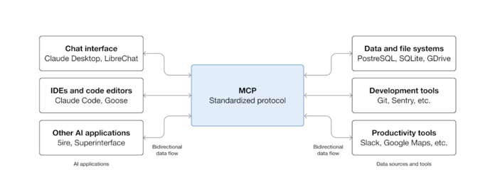

# MCP Introduction

LLM이 발달하면서 모델 자체의 사고 능력은 매우 빠르게 발전하고 있지만, 가장 정교하게 구현된 모델조차도 데이터와의 고립으로 인해 정보 사일로와 레거시 시스템에 갇히는 제약을 받습니다.  

이러한 현실에서 LLM이 새로운 데이터 소스를 활용할 수 있도록 연결해주는 프로토콜이 MCP ( Model Context Protocol ) 입니다.  

MCP의 뜻을 풀어서 보면, Model ( AI-모델 에게 ) Context ( 사용자가 원하는 맥락을 제공해주는 ) Protocol ( 통신 규약 ) 이라고 이해할 수 있습니다.  

특히 Context는, 프롬프트 엔지니어링에서 매우 중요한 요소입니다.  
사용자가 모델에게 어떤 맥락 속에서 답변을 원하는지 명시하여, 더욱 정확한 정보를 사용자에게 제공할 수 있기 때문입니다.  

따라서, MCP는 개발자가 데이터 소스 ( Server, Spreadsheet, File System ... ) 와 AI 도구 간 안전한 양방향 연결을 구축할 수 있도록 지원하는 개방형 표준이며, 이를 처음 세상에 공개한 것이 `Anthropic`입니다.

## Why MCP Required?

현재 AI 모델 중, 특히 LLM이 사용자들과 많은 상호작용을 통해 가치있는 무언가를 생산하고 있습니다. 이 도구가 더욱 더 높은 수준의 추상화로 구체적인 산출물을 사용자에게 제공하기 위해서는 LLM이 정보를 찾아서 가공하는 것뿐만 아니라, 외부의 API를 직접 가져다 사용하는 `행동 가능성`이 필요합니다.  

이때 이 행동들의 인터페이스가 각 데이터 소스마다 다르다면, 모든 새로운 데이터 소스는 자체적인 맞춤형 구현이 필요하며 외부 서비스로의 확장에 제약이  
생길 수 밖에 없습니다. 따라서 확장가능한 형식의 표준을 단일 프로토콜로 제공하는 안정적인 방법이 필요하며, 이에 MCP가 필수적인 것입니다.



## MCP Architecture

MCP는 Client-Server 구조를 따릅니다. `MCP Server`는 위에서 언급한 데이터 소스 제공자로, 외부 AI에게 제공할 수 있는 인터페이스를 열어서 Context를  
제공합니다.  

`MCP Client`는 MCP Server와의 연결을 유지하고, MCP Host가 MCP Server로부터 사용자의 요청 응답에 Context를 사용할 수 있도록 리소스를 불러오는 구성 요소입니다.  

여기서 중요한 것은 `MCP Host`가 우리가 사용하고 있는 AI Application이라는 점이며, 하나의 MCP Host가 사용할 MCP Server의 수만큼 MCP Client를  
만들어 관리합니다.


> Claude Desktop을 사용하여 회원 정보 서버와 구매 기록 서버에 각각 요청을 보내는 경우, Claude Desktop은 MCP Host로서  
> 여러 MCP Server(회원정보 서버, 구매기록 서버 등)와 통신한다고 표현할 수 있습니다.

## MCP Layer

MCP는 `데이터 계층`과 `전송 계층`으로 나눠집니다.

### 데이터 계층
데이터 계층에서는 클라이언트와 서버사이 `상태 라이프사이클 관리`, `서버 기능`, `클라이언트 기능` 그리고 기타 유틸리티 기능을 제공합니다.  
이러한 기능을 위해 클라이언트와 서버는 `JSON-RPC 2.0` 통신 규약을 사용합니다.  

> **JSON-RPC 2.0**  
> JSON(JavaScript Object Notation) 형식으로 원격 프로시저 호출(Remote Procedure Call, RPC)을 수행하기 위한 경량 프로토콜입니다.  
> 
> 즉, 클라이언트가 JSON 형식으로 요청을 보내고, 서버가 JSON 형식으로 응답을 돌려주는 방식입니다. ( HTTP와는 다르다! )  
> 
> **HTTP + JSON**  
> /users라는 리소스에 새로운 유저를 추가
> (리소스 중심, RESTful API)
>
> **JSON-RPC**  
> createUser() 함수(Remote Procedure)를 실행요청(Call). 인자: {name: 'Hwan'}  
> (함수 호출 중심, RPC 스타일)
> 
> JSON-RPC 2.0에서는 프로토콜 구조가 보다 명확한 Client–Server 모델로 정리되었으며, 전송 방식(HTTP, WebSocket 등)과 독립적으로 동작하도록 설계되었습니다.

서버 기능은 AI가 작업을 위해 실행할 수 있는 기능인 `도구 모음`을 통해 `리소스`( 파일 콘텐츠, 데이터베이스 레코드 ...)를 받아 사용자에게 제공하는 것입니다.   
이 중 `시스템 프롬프트`를 관리하는 것 또한 서버 기능의 핵심 중 하나입니다.  

클라이언트 기능은 서버 개발자가 MCP Client를 더욱 효율적으로 사용하기 위해 존재하는 기능입니다.  
클라이언트 기능에는 `Sampling`과 `Elicitation`가 있습니다.  

#### Sampling

Sampling을 통해 MCP Server에서 MCP Client를 호출할 수 있습니다. 다시 말해, MCP Client을 통해서 LLM 모델에 질의를 전달하는 것입니다.  
예를 들어, "사용자가 구매 내역을 만들어서 요약해줘" 라는 요청을 MCP Host에게 전달하였을 때 MCP Server가 구매 내역을 제공하고, 이에 대한 요약을 위해  
LLM 모델을 직접 호출하는 것이 아닌 MCP Client에게 요약 처리를 위임하는 것입니다.  

Sampling을 통해 MCP Server는 언어 모델 SDK나 API Key 없이 LLM을 사용할 수 있습니다.  

```json
{
  "method": "sampling/complete",
  "params": {
    "model": "claude-3.5-sonnet",
    "prompt": "Summarize the following purchase history in one sentence:",
    "temperature": 0.7
  }
}
```


#### Elicitation

Elicitation 통해 MCP Server가 사용자에게 질의를 던질 수 있습니다. 예를 들어 삭제/수정과 같은 재확인이 필요한 작업을 수행 할 때, 사용자에게 동의를 구하기  
위해 MCP Client에 Elicitation을 활용해 요청을 보낼 수 있습니다.  

```json
{
  "method": "elicitation/request",
  "params": {
    "message": "Please confirm: Do you want to delete all purchase history?",
    "options": ["Yes", "No"]
  }
}
```


### 전송 계층

MCP의 전송 계층은 클라이언트와 서버가 서로 `통신할 수 있는 채널`과 `인증 과정`을 관리하는 영역입니다.
이 계층은 환경에 따라 다양한 상황을 지원할 수 있도록 두 가지 전송 메커니즘을 제공합니다.

#### 표준 입출력(STDIO)

동일한 머신 내에서 프로세스 간 통신을 수행할 때 사용되며, 가볍고 신뢰성이 높은 로컬 환경용 전송 메커니즘입니다.

#### 스트리밍 가능한 HTTP

클라이언트와 서버 간의 메시지는 HTTP POST를 통해 주고받으며, 필요한 경우 서버 전송 이벤트를 사용해  
스트리밍 통신을 수행할 수 있습니다.  

이 방식은 원격 서버와의 연결을 가능하게 하고, 베어러 토큰, API 키, 사용자 지정 헤더 등 표준 HTTP 인증 체계를 지원합니다.

> MCP는 특히 OAuth 기반의 인증 토큰 획득을 권장하고 있습니다.

---

결국 전송 계층은 이러한 통신 세부 정보를 프로토콜 계층으로부터 추상화하여, 어떤 전송 메커니즘을 사용하더라도 동일한 `JSON-RPC 2.0` 메시지 포맷으로 통신이 이루어지도록 설계되어 있습니다.  

이를 통해 MCP는 다양한 환경에서 일관된 방식으로 클라이언트와 서버 간 상호작용을 가능하게 합니다.

## Summary

MCP란 AI Model에게 사용자가 원하는 Context를 제공하기 위해 규정된 통신 규약이며, Anthropic사가 처음 세상에 공개했다.  
LLM이 크롤링 등을 통해 raw 데이터들을 수집해 답변하는 수준을 넘어서, 표준화된 통신 규약을 통해 수많은 MCP 서버들과 상호작용을 할 수 있게 됐다.  

우리가 사용하는 LLM이 MCP Host가 되어 기능이 필요한 MCP Server들과 통신하기 위해 MCP Client를 운용한다.  

서버 개발자는 MCP의 데이터 계층에서 제공하는 기능들을 적절히 활용해 사용자에게 높은 수준의 추상화를 통해 구체적인 산출물을 제공할 수 있도록 기여할 수 있다. 