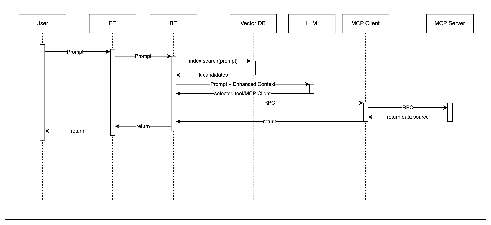

# MCP_Usage

Claude Desktop과 같은 MCP Host가 MCP Server와 통신하는 기본적인 서비스 흐름은 아래와 같습니다.  

하지만 이 구조에서 벗어나, 조금 더 일반적으로 사용할 수 있는 구조를 고민해보면,  
MCP Host를 직접 구현해볼 수 있을 것입니다.

이 과정에서, Claude Desktop은 사용자가 사용하고 싶은 MCP Server를 선택하는 옵션이 존재해 `MCP Client Discovery`를 진행할 필요가 없었습니다.  
하지만 MCP Host를 직접 구현하는 과정에서 MCP Server를 선택하는 행위 자체를 제거해 사용자가 오직 자연어 프롬프트만으로 구체적인 산출물을 받을 수 있다면, 
더 높은 가치를 사용자에게 제공해줄 수 있을 것이라 생각해 `Function Calling`을 MCP Client Discovery에 적용해보고자 합니다.  

## LLM Function Calling

Function Calling은 OpenAISpec에 호출 가능한 함수의 사양을 정의해 둔 뒤, 해당 내용을 LLM에게 프롬프트와 함께 요청을 보냅니다.  
이제 LLM이 프롬프트를 처리할 수 있는 함수를 선택해 응답합니다. 이후 이 함수를 서버가 실행해 결과값을 사용자에게 응답합니다.  

결국 사용자는 자연어로 서버의 특정 함수를 호출할 수 있게 되는 것입니다.  

하지만 OpenAISpec에 정의된 함수의 스펙의 양이 무수히 많아지면, 함수 선별에 사용되는 토큰의 양이 기하급수적으로 늘어나 비용적으로 부담이 발생합니다.  
또한 모델의 Context Window를 초과해 비용 문제가 아닌 성능 문제로도 이어질 가능성히 다분히 존재합니다.  

> 현 모델 중, Llama 4 Scout의 Context Window 크기가 10,000,000 토큰으로 가장 많은 용량을 제공해줍니다.  
> 그럼에도, 비즈니스에서 사용되는 함수 스펙을 정의할 때 낙관적으로 1200토큰이 사용된다고 할 때, 약 8천개의 API 스펙을 정의할 수 있습니다.  
> 
> 하지만 이는 순수히 OpenAISpec만을 고려했을 때 예상할 수 있는 스펙의 수치이며 시스템 프롬프트와 사용자 프롬프트등 여러 추가 자원이 사용될 때 더욱 더 스펙이 사용할 수 있는 분량은 줄어들 것입니다.

따라서 RAG 기법이 필요합니다. 사용자가 호출할 수 있는 함수들의 스펙을 벡터로 변환한 뒤에 함수 이름과 설명등의 메타 데이터와 함께 벡터 데이터베이스에 저장합니다.  
이후 사용자 요청이 들어오면, 임베딩 모델을 사용해 프롬프트 텍스트를 벡터화시킵니다. 해당 벡터 데이터를 바탕으로 벡터 유사도가 높은 상위 k개를 검색해 후보군을 생성합니다.  
마지막으로 LLM에게 정제된 함수 후보와 함께 프롬프트를 요청하면 비용과 성능에 대한 최적화를 기대할 수 있을 것입니다. 

## MCP Host Flow

그래서 이를 바탕으로 MCP Host의 실행 흐름을 설계해보면 아래와 같습니다.  

### Normal Flow

### Sampling Flow

### Elicitation Flow

## Practice

### Spec

| 구분 | 기술 스택 / 버전 |
|------|----------------|
| 운영 환경 | Kubernetes |
| Front-End | React 19.2.0 |
| Back-End (BE) | Spring Boot 3.5.5 + Java 21 + WebFlux + Spring AI |
| Vector DB | InMemoryVectorStore (Spring AI) → Weaviate (Docker Image 사용) |
| LLM | GPT-5 mini |
| MCP Client & Server | Spring Boot 3.5.5 + Java 21 + WebFlux |

### Object

본 실습에서는 아래 백로그 순서대로 구성을 해보면서 결과를 기록해나갈 예정입니다.  

1. 단일 MCP Server 
   - 일반적인 호출 상황
   - Sampling 호출 상황
   - Elicitation 호출 상황

2. 복수 MCP Server
   - 일반적인 호출 상황
   - Sampling 호출 상황
   - Elicitation 호출 상황