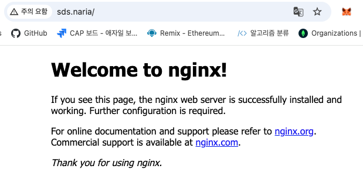

# MCP_Practice

MCP Host를 구성하기 앞서, 로컬 운영 환경을 쿠버네티스로 구성하고자 합니다.

## Kind ( Kubernetes In Docker )

Kind를 사용해 단일 노드 ( Only Control Plane ) 쿠버네티스를 구성해보겠습니다.

Kind란 Docker 컨테이너로 쿠버네티스 노드를 구성하는 도구입니다. 하나의 컨테이너로 하나의 쿠버네티스 노드를 구성합니다.  

실습 환경은 MacOS이며, 오픈 소스인 Colima로 docker engine을 구동할 것입니다.  

### Resource Install

#### Docker Runtime

```shell
brew update

# Colima를 로컬 Mac 환경에 설치합니다.
brew install colima

# 설치 후 구동한 뒤, 상태를 확인합니다. / 기본적으로 Mac 부팅시 자동으로 실행하게 합니다.
colima start

colima status

INFO[0000] colima is running using macOS Virtualization.Framework 
INFO[0000] arch: aarch64                                
INFO[0000] runtime: docker                              
INFO[0000] mountType: virtiofs                          
INFO[0000] docker socket: unix:///Users/hwany/.colima/default/docker.sock 
INFO[0000] containerd socket: unix:///Users/hwany/.colima/default/containerd.sock

# docker의 context가 colima로 되어있는지 확인합니다.  
docker context ls

NAME              DESCRIPTION                               DOCKER ENDPOINT                                   ERROR
colima *          colima                                    unix:///Users/hwany/.colima/default/docker.sock   
default           Current DOCKER_HOST based configuration   unix:///var/run/docker.sock                       
desktop-linux     Docker Desktop                            unix:///Users/hwany/.docker/run/docker.sock       
rancher-desktop   Rancher Desktop moby context              unix:///Users/hwany/.rd/docker.sock   
```

#### Kind Install

```shell
brew install kind

# kubectl v1.33.0 버전 다운로드 **클러스터의 마이너 버전 차이 내에 있는 kubectl 버전을 사용해야 합니다.
curl -LO "https://dl.k8s.io/release/v1.33.0/bin/darwin/arm64/kubectl"

# kubectl을 환경 변수가 등록된 위치로 옮기고 실행 권한을 부여합니다.
sudo mv kubectl /usr/local/bin/
sudo chmod +x /usr/local/bin/kubectl

# 약어 등록
vi ~/.zshrc 

alias k='kubectl'

# kubectl 버전 확인
k version --client

Client Version: v1.34.1
Kustomize Version: v5.7.1
```

## Create Kubernetes Environment

단일 노드로 구성할 것이고, Ingress Controller가 로컬 호스트의 요청을 노드 로컬로 포워딩 해줄 수 있도록 `extraPortMapping`을 함께 설정해주겠습니다.  

```yaml
kind: Cluster
apiVersion: kind.x-k8s.io/v1alpha4
name: local-cluster
nodes:
  - role: control-plane
    extraPortMappings:
      - containerPort: 80
        hostPort: 80
        protocol: TCP
      - containerPort: 443
        hostPort: 443
        protocol: TCP
    kubeadmConfigPatches:
      - |
        kind: InitConfiguration
        nodeRegistration:
          kubeletExtraArgs:
            node-labels: "ingress-ready=true"
```

25년 10월 17일 기준 안정화된 쿠버네티스 v1.33.0으로, 준비한 `kind-config.yaml`의 설정으로 생성합니다.  

```shell
kind create cluster --name local-cluster --image kindest/node:v1.33.0 --config kind-config.yaml

Creating cluster "local-cluster" ...
 ✓ Ensuring node image (kindest/node:v1.33.0) 🖼 
 ✓ Preparing nodes 📦  
 ✓ Writing configuration 📜 
 ✓ Starting control-plane 🕹️ 
 ✓ Installing CNI 🔌 
 ✓ Installing StorageClass 💾 
Set kubectl context to "kind-local-cluster"
You can now use your cluster with:

kubectl cluster-info --context kind-local-cluster

Have a question, bug, or feature request? Let us know! https://kind.sigs.k8s.io/#community 🙂
```

> Docker Image Pull Error
> ```shell
> kind create cluster --config kind-config.yaml 
> Creating cluster "local-cluster" ... ✗ 
> Ensuring node image (kindest/node:v1.34.0) 🖼 
> ERROR: failed to create cluster: failed to pull image "kindest/node:v1.34.0@sha256:7416a61b42b1662ca6ca89f02028ac133a309a2a30ba309614e8ec94d976dc5a": 
> command "docker pull kindest/node:v1.34.0@sha256:7416a61b42b1662ca6ca89f02028ac133a309a2a30ba309614e8ec94d976dc5a" failed with error: 
> exit status 1 Command Output: Please login prior to pull: 
> Error: Cannot perform an interactive login from a non TTY device
> ```
> 
> local에서 Docker Hub에 대한 인증이 돼있지 않아 발생한 문제로, docker login으로 인증권한을 가져오면 해결됩니다.
> 
> ```shell
> docker login
> ```

이후 쿠버네티스 구성이 잘 되었는지 확인합니다. 

```shell
k get nodes
NAME                          STATUS   ROLES           AGE   VERSION
local-cluster-control-plane   Ready    control-plane   30m   v1.33.0

docker ps
CONTAINER ID   IMAGE                  COMMAND                  CREATED          STATUS          PORTS                                                                 NAMES
0a9056fa9c8d   kindest/node:v1.33.0   "/usr/local/bin/entr…"   30 minutes ago   Up 30 minutes   0.0.0.0:80->80/tcp, 0.0.0.0:443->443/tcp, 127.0.0.1:50958->6443/tcp   local-cluster-control-plane
```

`kind-config.yaml`에 설정해둔 포워딩 정보가 잘 반영된 것을 컨테이너 PORTS 정보를 통해 확인할 수 있습니다.  

### Ingress Resource

이제 구성한 쿠버네티스가 Ingress를 통해 파드까지의 통신을 가능하게 구성하겠습니다.  

우선, 쿠버네티스의 추상적 자원인 Ingress 리소스를 실제로 구동하는 Ingress Controller를 설치합니다.  

```shell
k apply -f https://raw.githubusercontent.com/kubernetes/ingress-nginx/main/deploy/static/provider/kind/deploy.yaml

k get all -n ingress-nginx
NAME                                            READY   STATUS    RESTARTS   AGE
pod/ingress-nginx-controller-5747fd6f89-6mvtx   1/1     Running   0          83s

NAME                                         TYPE           CLUSTER-IP    EXTERNAL-IP   PORT(S)                      AGE
service/ingress-nginx-controller             LoadBalancer   10.96.142.0   <pending>     80:31902/TCP,443:31135/TCP   83s
service/ingress-nginx-controller-admission   ClusterIP      10.96.57.3    <none>        443/TCP                      83s

NAME                                       READY   UP-TO-DATE   AVAILABLE   AGE
deployment.apps/ingress-nginx-controller   1/1     1            1           83s

NAME                                                  DESIRED   CURRENT   READY   AGE
replicaset.apps/ingress-nginx-controller-5747fd6f89   1         1         1       83s
```

이후 루프백 주소에 대한 도메인 이름을 설정해주기 위해 `/etc/hosts` 파일을 수정합니다.  

```shell
sudo sh -c 'grep -qxF "127.0.0.1 sds.naria" /etc/hosts || echo "127.0.0.1 sds.naria" >> /etc/hosts'
```

이제 Ingress 리소스를 적용해줍니다.  

Ingress Controller YAML 내부에서 자신이 처리할 클래스 이름(nginx)을 정의하고 있으므로, Ingress 리소스에서도 동일한 `ingressClassName: nginx`를 지정해야 해당 Controller가 Ingress를 처리할 수 있습니다. 

```yaml
apiVersion: networking.k8s.io/v1
kind: Ingress
metadata:
  name: web-ingress
  annotations:
    nginx.ingress.kubernetes.io/rewrite-target: /
spec:
  ingressClassName: nginx
  rules:
  - host: sds.naria          
    http:
      paths:
      - path: /
        pathType: Prefix
        backend:
          service:
            name: web
            port:
              number: 80
```

```shell
k apply -f ingress.yaml

k get ingress
NAME          CLASS   HOSTS       ADDRESS   PORTS   AGE
web-ingress   nginx   sds.naria             80      15s
```

#### Network Test

구성한 Ingress가 트래픽을 내부 파드까지 잘 전달하는지 테스트하기 위해 테스트용 Nginx를 배포해 확인해보겠습니다.  

```shell
k create deployment web --image=nginx --replicas=1
k expose deployment web --port=80
```



정상적으로 트래픽이 넘어간 것을 확인하였으니 자원을 정리해줍니다.  

```shell
k delete deploy web
k delete svc web
k delete ingress web-ingress
```
