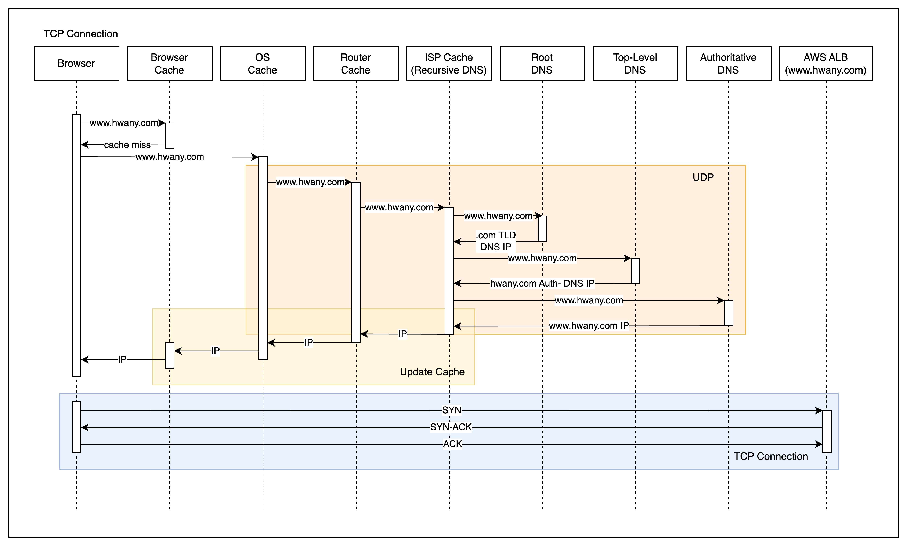
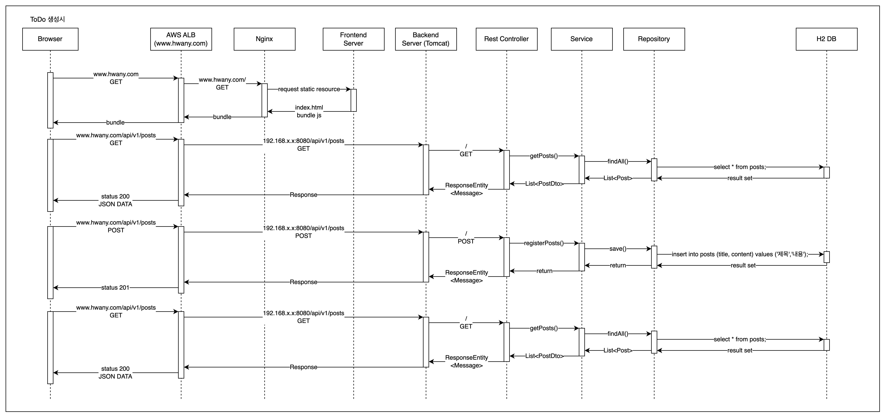
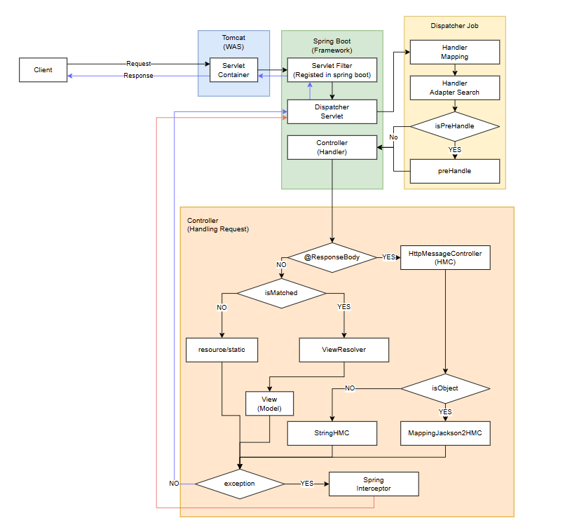

# How Your ToDo List Works?

## 어디로 보내야 할까요?

브라우저는 우리가 www.google.com을 입력하기 전까지 ( 첫 요청일 경우 ) 요청을 받는 서버가 누구고, 어디인지 알 지 못합니다.  
그렇기 때문에 우리가 사용하는 도메인 주소의 주인이 누구인지 확인하는 과정인 DNS 질의부터 시작합니다.

브라우저는 우선 도메인에 대한 IP주소를 가지고 있는지, `browser -> OS -> Router` 순서로 캐시를 확인합니다.

그럼에도 없다면, ISP cache까지 확인 후, ISP는 Recursive DNS가 돼 DNS 질의를 재귀적으로 진행하게 됩니다.

`Root DNS`에 `Top-Level DNS` IP 주소를 질의하고, `Authoritative DNS` IP 주소를 질의하고, 이후 SubDomain에 대한 질의를 이어서 www.google.com의 IP 주소를 받아옵니다.

이후 `ISP -> Router -> OS -> Browser`로 UDP 데이터그램이 전달되고, 질의 DNS의 IP 주소에 대한 값을 캐싱합니다.

이후에 우리 브라우저는 요청을 받는 서버의 IP주소를 알았으니, TCP connection 연결을 위한 `3-way-handshake`를 진행합니다.

> [!NOTE]  
> TCP 3-way-handshake는 한 번만 이루어지는 것이 아니라, 매 요청마다, 각 시스템 노드마다 매 번 시행됩니다. 브라우저와 ALB, ALB와 WebServer, WebServer와 WebApp, WebApp과 DB 사이, TCP 통신이 필요한 모든 곳에서 수행돼야 합니다.

## 저는 보냈어요. 그럼 안에서는요?

우리 프로젝트 환경에서 서버는 EKS에 배포됐습니다. 단일 진입점으로 ALB만 클라이언트는 알고 있고 내부 로직은 모르기 때문에, 클라이언트는 오로지 ALB의 공인IP주소로만 통신합니다.

클라이언트는 TCP Connection을 맺은 뒤, ALB에 `/ GET` 요청을 보냅니다.

ALB는 / 로 들어온 GET 요청을 NGINX로 넘겨주고, 웹서버는 미리 정해진 규칙에 따라 ReactApplication에 정적 자원을 요청 후 값을 넘겨줍니다.

브라우저는 index.html과 번들링된 js 파일을 받아 화면을 그릴 수 있게 됐습니다.

이제 화면에 그릴 데이터를 받아와야 하는데, 이때에는 브라우저 캐시에 도메인의 IP가 있기 때문에 DNS를 거치지 않고 바로 ALB와 TCP-connection을 맺습니다.

성공적으로 연결을 맺었으면 이번에는 ALB에 `/api/v1/posts GET` 요청을 보냅니다.

ALB는 url이 /api/v1으로 시작하기에 트래픽을 Nginx가 아닌 Tomcat WAS에 보냅니다.

이후 아래와 같은 구조로 스프링 부트 어플리케이션이 구동된 뒤에 응답값을 브라우저가 받게 됩니다.

> [!IMPORTANT]  
> 아쉬운 점은 EKS환경을 자세히 알지 못하기 때문에 ALB와 내부 쿠버네티스 리소스가 어떤 식으로 통신하는지 그리지 못했습니다.  
> 다시 이 프로세스를 그릴 때에는 그것도 포함해서 여러 레이어로 ( 3 tier + EKS + ... ) 그려보고 싶습니다.
