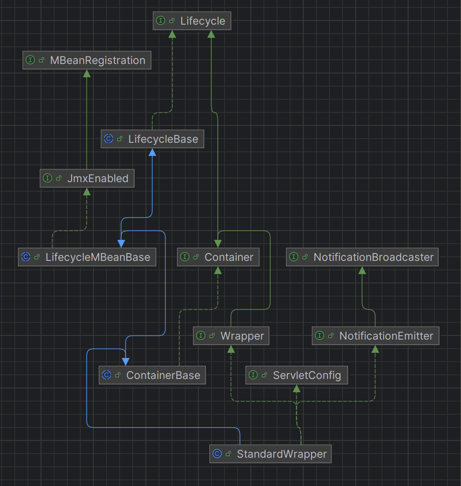

tomcat 구동(servlet container)
```java
org.apache.catalina.core.StandardWrapper
    └── public synchronized void load() throws ServletException {
            ...
            instance = servletClass.newInstance();
            instance.init(facade); // <-- 여기가 DispatcherServlet.init() 호출 지점!
            ...
       }
```
해당 dispatcherServlet의 init() 메서드 호출

StandardWrapper에, getServlet()과 setServlet()이 오버라이딩 돼있음 ( Container를 상속한 Wrapper 인터페이스 , LifeCycle을 상속한 Container 인터페이스)

  

Dispatcher servlet 은 jspServlet이 아니다.
그래서, StandardWrapper.load() 의 initServlet 실행
그 전에 loadServlet()으로 Servlet 가져옴

loadServlet()에서, servletClass를 가지고 instanceManager가 새로운 servlet을 만듬
```java
@Override
    public void setServletClass(String servletClass) { // wrapper 꺼

        String oldServletClass = this.servletClass;
        this.servletClass = servletClass;
        support.firePropertyChange("servletClass", oldServletClass, this.servletClass);
        if (Constants.JSP_SERVLET_CLASS.equals(servletClass)) {
            isJspServlet = true;
        }
    }
```
얘는 누가 실행시키는 것일까?
