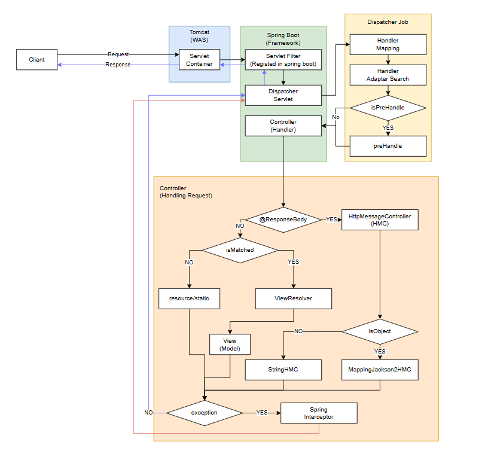

# Spring WebMVC - Dispatcher Servlet

## Tomcat Servlet과 Springboot Servlet의 차이

스프링부트 어플리케이션을 시작할 때 Tomcat WAS가 함께 구동됩니다.  
결론적으로, DispatcherServlet은 TomcatSerlvet를 상속받은 클래스입니다.  

  

그래서 실제로 톰켓이 구동되면서 `HttpServletRequest`와 `HttpServletResponse` 객체를 만들어 클라이언트의 API 요청들을 처리할 수 있는 객체 형식으로 스프링 웹 어플리케이션으로 넘겨줍니다.  

이러한 요청/응답 객체를 다루기 위해서 Tomcat의 `HttpServlet`을 상속받은 `HttpServletBean` 추상 클래스를 통해 `DispatcherServlet` 클래스를 만들어 사용자 요청을 처리합니다.  

사실상 Spring Servlet과 Tomcat Servlet은 구현체들의 역할만 다를 뿐 근간은 Tomcat Servlet의 `GenericServlet` 추상 클래스입니다.  

## Dispatcher Servlet 초기화

Dispatcher Servlet은 생성자가 두 가지가 있습니다.  

```java
    public DispatcherServlet() {
        setDispatchOptionsRequest(true);
    }

    public DispatcherServlet(WebApplicationContext webApplicationContext) {
        super(webApplicationContext);
        setDispatchOptionsRequest(true);
    }
```

생성자에 WebApplicationContext를 넘겨주는 경우에 해당 DispatcherServlet은 해당 설정값을 사용합니다.  
이 경우, WebApplicationContext가 ConfigurableWebApplicationContext 타입인지 확인 후 해당 context를 등록합니다.

```java
if (wac instanceof ConfigurableWebApplicationContext cwac && !cwac.isActive())
```

---

생성자에 WebApplicationContext를 넘겨주지 않는 경우엔 WebContext를 찾는 과정을 진행합니다.  

WebApplicationContext가 super 키워드로 DispatcherServlet의 부모 추상 클래스인 FrameworkServlet에 넘겨지지 않으면, FrameworkServlet의 webApplicationContext 필드는 기본적으로 null입니다.  

```java
// FrameworkServlet
@Nullable
private WebApplicationContext webApplicationContext;
```

### HttpServletBean.initServletBean()

이 경우에, `SpringApplication.run(...)`을 실행하면, DispatchServlet의 빈등록을 위해 생성하는 과정에서, 
`HttpServletBean`의 `initServletBean`를 오버라이드한 메서드를 통해 WebApplicationContext 초기화가 시작됩니다.

이후 webApplicationContext를 불러오기 위해 `initWebApplicationContext()`를 호출합니다.  

`findWebApplicationContext()`를 호출해 `ServletContext`에 등록된 WebApplicationContext를 찾습니다.  

```java
WebApplicationContext wac =
				WebApplicationContextUtils.getWebApplicationContext(getServletContext(), attrName);
```

만일 findWebApplicationContext()가 null을 리턴했으면, FrameworkServlet에 있는 default context가 사용됩니다. 

```java
public static final Class<?> DEFAULT_CONTEXT_CLASS = XmlWebApplicationContext.class;
```

[//]: # (### ApplicationContextAware)

[//]: # ()
[//]: # (FrameworkServlet을 상속받아 구현한 DispatcherServlet의 webApplicationContext 필드의 값이 null임을 확인하면, `Spring`이 `ApplicationContextAware`를 호출하고, 해당 클래스를 구현한 FrameworkServlet의 setApplicationContext 오버라이드 메서드를 통해서 WebApplicationContext가 등록됩니다.  )

---

> [!NOTE]  
> 기본적으로 스프링부트가 dispatcherServlet을 빈 등록할 때, `AnnotationConfigServletWebServerApplicationContext`를 사용합니다.  
> ```java
> /**
>	 * Sets the factory that will be called to create the application context. If not set,
>	 * defaults to a factory that will create
>	 * {@link AnnotationConfigServletWebServerApplicationContext} for servlet web
>	 * applications, {@link AnnotationConfigReactiveWebServerApplicationContext} for
>	 * reactive web applications, and {@link AnnotationConfigApplicationContext} for
>	 * non-web applications.
>	 * @param applicationContextFactory the factory for the context
>	 * @since 2.4.0
>	 */
>	public void setApplicationContextFactory(ApplicationContextFactory applicationContextFactory) {
>		this.applicationContextFactory = (applicationContextFactory != null) ? applicationContextFactory
>				: ApplicationContextFactory.DEFAULT;
>	}
>
> ```

## Dispatcher Cycle

### 모델을 사용하는 경우

  

### @ResponseBody


