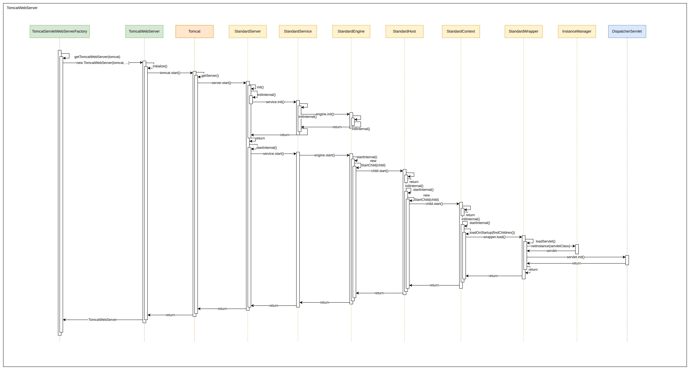
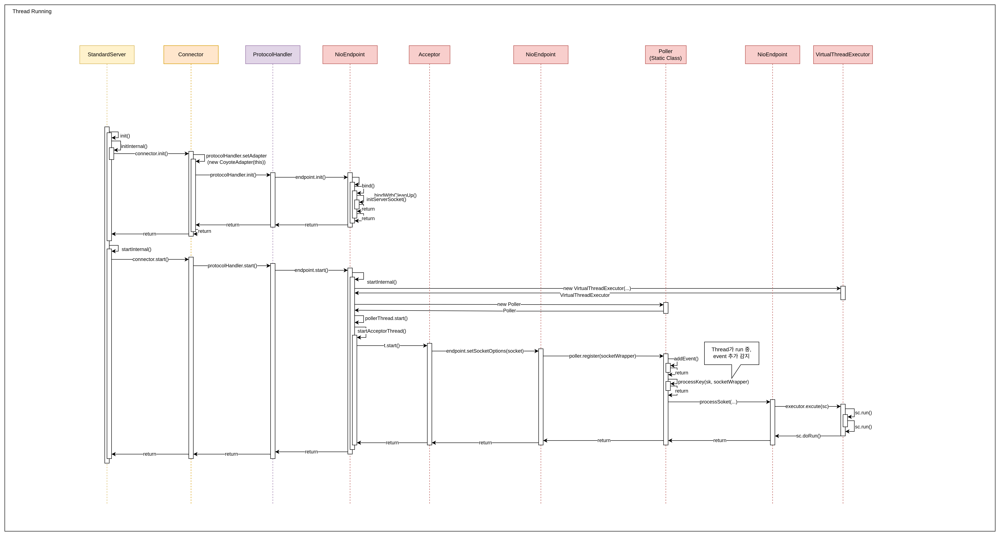

# Servlet and ServletContainer

## tomcat.start()

[dispatcher servlet 등록](dispatcherServletCreation.md)에서 우리는 spring의 dispatcher servlet이 어떻게 `servlet context(jakarta.servlet)`에 등록되고, tomcat이 실행되는지 살펴보았습니다.

`ServletWebServerApplicationContext`이 `TomcatServletWebServerFactory`에 `getWebServer()`요청을 보낼 때 TomcatWebServer 객체가 생성됩니다.  

```java
package org.springframework.boot.web.embedded.tomcat;

public class TomcatServletWebServerFactory extends AbstractServletWebServerFactory
        implements ConfigurableTomcatWebServerFactory, ResourceLoaderAware {
    @Override
    public WebServer getWebServer(ServletContextInitializer... initializers) {
        // ...
        return getTomcatWebServer(tomcat);
    }

    protected TomcatWebServer getTomcatWebServer(Tomcat tomcat) {
        return new TomcatWebServer(tomcat, getPort() >= 0, getShutdown());
    }
}
```

이 때, TomcatWebServer 객체가 생성되면서, 스프링부트 어플리케이션의 구동보다 한차례 앞서 tomcat이 구동되게 됩니다.  

```java
package org.springframework.boot.web.embedded.tomcat;
public class TomcatWebServer implements WebServer {
    public TomcatWebServer(Tomcat tomcat, boolean autoStart, Shutdown shutdown) {
        // ...
        initialize();
    }

    private void initialize() throws WebServerException {
        // ...
        synchronized (this.monitor) {
            try {
                // ...
                // Start the server to trigger initialization listeners
                this.tomcat.start();
                // ...
            }
            catch (Exception ex) {
                // ...
            }
        }
    }
}
```

## tomcat 구동 과정

이제 TomcatWebServer 객체가 `tomcat.start()` 를 호출하면, tomcat의 초기화와 내부 리소스가 시작됩니다.  

> Tomcat 의 main 메서드  
> 
> SpringBoot의 내장 톰켓의 경우, Tomcat의 main 메서드를 실행시키지 않고, LifeCycle(org.apache.catalina)로 관리됩니다.  

결론적으로, Tomcat은 `Lifecycle`을 상속받는 `Server` 구현체를 가지고 있고, 이 Server 구현체 안에 리소스를 넣어 관리합니다.  

Server -> Service -> Engine -> Host -> Context -> Wrapper  
순으로 서로를 포함하고, 트래픽이 넘어갑니다.  

### init

```java
package org.apache.catalina.startup;

public class Tomcat {
    // ...
    public void start() throws LifecycleException {
        getServer();
        server.start();
    }
    // ...
    public Server getServer() {
        if (server != null) {
            return server;
        }
        // ...
        server = new StandardServer();
        // ...
        Service service = new StandardService();
        service.setName("Tomcat");
        server.addService(service);
        return server;
    }
}
```

tomcat의 start 메서드가 호출되면, server 리소스를 가져와 구동(start())시킵니다.  
메서드를 타고가면, `LifeCycleBase(org.apache.catalina.util)` 의 start() 메서드와 마주하게 됩니다.  

```java
public abstract class LifecycleBase implements Lifecycle {
    // ...
    @Override
    public final synchronized void start() throws LifecycleException {
        // ...
        if (state.equals(LifecycleState.NEW)) {
            init();
        } else if (state.equals(LifecycleState.FAILED)) {
            // ...
        } else if (!state.equals(LifecycleState.INITIALIZED) && !state.equals(LifecycleState.STOPPED)) {
            // ...
        }

        try {
            // ...
            startInternal();
            if (state.equals(LifecycleState.FAILED)) {
                // ...
            } else if (!state.equals(LifecycleState.STARTING)) {
                // ..
            } else {
                // ...
            }
        } catch (Throwable t) {
            // ...
        }
    }

    @Override
    public final synchronized void init() throws LifecycleException {
        // ...
        try {
            // ...
            initInternal();
            // ...
        } catch (Throwable t) {
            // ...
        }
    }

    protected abstract void initInternal() throws LifecycleException;
}
```

지금 현재 state는 LifeCycle상, NEW 상태이기 때문에, `init()` 메서드가 호출되게 됩니다.  
이후 LifeCycleState를 체크한 다음에, 각 리소스가 재정의한 initInternal 메서드가 호출되게 됩니다.  

실행 흐름상, `Server`의 `initInternal()`이 호출되게 됩니다.  


```java
package org.apache.catalina.core;
public final class StandardServer extends LifecycleMBeanBase implements Server {
    @Override
    protected void initInternal() throws LifecycleException {
        super.initInternal();
        // ...
        for (Service service : findServices()) {
            service.init();
        }
    }
}
```

> Server는 여러 개의 service를 가지고 있을 수 있습니다.  

Server의 기본 설정이 끝나면, service를 `init()` 해줍니다.  
이때 이 함수는 LifeCycle 인터페이스의 구현 메서드로, 동일하게 LifeCycleBase의 init()이 호출되고, service의 initInternal 구현 메서드가 호출되게 됩니다.  

```java
package org.apache.catalina.core;
public class StandardService extends LifecycleMBeanBase implements Service {
    @Override
    protected void initInternal() throws LifecycleException {

        super.initInternal();

        if (engine != null) {
            engine.init();
        }
        // ...
        // Initialize our defined Connectors
        for (Connector connector : findConnectors()) {
            connector.init();
        }
    }
}
```

> Service는 하나의 engine을 가질 수 있습니다.
> connector는 여러 개 가지고 있습니다.

engine 또한 LifeCycle의 init() 메서드를 구현하고있습니다.  

```java
package org.apache.catalina.core;
public class StandardEngine extends ContainerBase implements Engine {
    @Override
    protected void initInternal() throws LifecycleException {
        // Ensure that a Realm is present before any attempt is made to start
        // one. This will create the default NullRealm if necessary.
        getRealm();
        super.initInternal();
    }
}
```

init 단계는 engine까지만 설정을 초기화해줍니다.  

### start

init()이 끝나면, LifeCycleBase의 if 문을 벗어나 try문 안으로 들어오게 됩니다.  

```java
public abstract class LifecycleBase implements Lifecycle {
    // ...
    @Override
    public final synchronized void start() throws LifecycleException {
        // ...
        try {
            // ...
            startInternal();
            // ...
        } catch (Throwable t) {
            // ...
        }
    }
    protected abstract void startInternal() throws LifecycleException;
}
```

그럼 역시, `StandardServer` 가 구현한 `startInternal()` 메서드가 실행됩니다.  

```java
package org.apache.catalina.core;
public final class StandardServer extends LifecycleMBeanBase implements Server {
    @Override
    protected void startInternal() throws LifecycleException {

        fireLifecycleEvent(CONFIGURE_START_EVENT, null);
        setState(LifecycleState.STARTING);
        // ...

        // Start our defined Services
        for (Service service : findServices()) {
            service.start();
        }
        // ...
    }
}
```

`LifeCycleState.STARTING` 으로 상태를 변경한 뒤에, 자신이 가지고있는 service를 start() 시키는 것을 확인할 수 있습니다.  

```java
package org.apache.catalina.core;
public class StandardService extends LifecycleMBeanBase implements Service {
    @Override
    protected void startInternal() throws LifecycleException {
        // ...
        setState(LifecycleState.STARTING);
        // ...
        // Start our defined Container first
        if (engine != null) {
            engine.start();
        }
        // ...

        // Start our defined Connectors second
        for (Connector connector : findConnectors()) {
            // If it has already failed, don't try and start it
            if (connector.getState() != LifecycleState.FAILED) {
                connector.start();
            }
        }
    }
}
```

```java
package org.apache.catalina.core;
public class StandardEngine extends ContainerBase implements Engine {
    @Override
    protected void startInternal() throws LifecycleException {
        // ...
        // Standard container startup
        super.startInternal();
    }
}

// --- super.startInternal()
public abstract class ContainerBase extends LifecycleMBeanBase implements Container {
    // ...
    @Override
    protected void startInternal() throws LifecycleException {

        // ...
        Container[] children = findChildren();
        List<Future<Void>> results = new ArrayList<>(children.length);
        for (Container child : children) {
            results.add(startStopExecutor.submit(new StartChild(child)));
        }

        // ...

        // Start the Valves in our pipeline (including the basic), if any
        if (pipeline instanceof Lifecycle) {
            ((Lifecycle) pipeline).start();
        }

        setState(LifecycleState.STARTING);

        // Start our thread
        if (backgroundProcessorDelay > 0) {
            monitorFuture = Container.getService(ContainerBase.this).getServer().getUtilityExecutor()
                    .scheduleWithFixedDelay(new ContainerBackgroundProcessorMonitor(), 0, 60, TimeUnit.SECONDS);
        }
    }
    // ...
    private static class StartChild implements Callable<Void> {

        private final Container child;

        StartChild(Container child) {
            this.child = child;
        }

        @Override
        public Void call() throws LifecycleException {
            child.start();
            return null;
        }
    }
}
```

#### StandardEngine 의 Child?

engine이 구동되면서, engine이 가지고 있는 Container들과 pipeline이 구동됩니다.

여기에서 `Container`에 조금 주목할 필요가 있습니다. 특정 자원에 종속한 개념이 아니기 때문입니다.  

Container 인터페이스 java doc을 살펴보면, 

> Containers will exist at several conceptual levels within Catalina.     
> 
> `Engine` - Representation of the entire Catalina servlet engine, most likely containing one or more subcontainers that are either Host or Context implementations, or other custom groups.    
> 
> `Host` - Representation of a virtual host containing a number of Contexts.  
>
> `Context` - Representation of a single ServletContext, which will typically contain one or more Wrappers for the supported servlets.  
> 
> `Wrapper` - Representation of an individual servlet definition.  

여기서, Engine이 자식으로 여러개의 Host와 Context를 가질 수 있다는 내용이 있습니다.  
그렇기 때문에 무엇이 들어가는 것일까란 고민을 했습니다.  

StandardServer를 초기화 할 때, `MBeanFactory`를 등록하는 과정이 있습니다.  

```java
public final class StandardServer extends LifecycleMBeanBase implements Server {
    // ...
    @Override
    protected void initInternal() throws LifecycleException {
        // ...
        // Register the MBeanFactory
        MBeanFactory factory = new MBeanFactory();
        factory.setContainer(this);
        onameMBeanFactory = register(factory, "type=MBeanFactory");
        // ...
    }
    // ...
}
```

MBeanFactory가 무슨 일을 하는지, doc이 적혀있지는 않았지만, 코드를 보았을때 Tomcat 리소스 ( Server, Service ...) 등을 생성하며 container들을 넣어주는 작업을 하고 있었습니다.  

```java
package org.apache.catalina.mbeans;
public class MBeanFactory {
    // ...
    public String createStandardHost(String parent, String name, String appBase, boolean autoDeploy,
                                     boolean deployOnStartup, boolean deployXML, boolean unpackWARs) throws Exception {
        StandardHost host = new StandardHost();
        // ...
        // add HostConfig for active reloading
        ObjectName pname = new ObjectName(parent);
        Service service = getService(pname);
        Engine engine = service.getContainer();
        engine.addChild(host);
        // ...
    }
    // ...
    public String createStandardContext(String parent, String path, String docBase, boolean xmlValidation,
                                        boolean xmlNamespaceAware) throws Exception {
        StandardContext context = new StandardContext();
        // ...
        // Add the new instance to its parent component
        ObjectName pname = new ObjectName(parent);
        ObjectName deployer = new ObjectName(pname.getDomain() + ":type=Deployer,host=" + pname.getKeyProperty("host"));
        if (mserver.isRegistered(deployer)) {
            // ...
        } else {
            log.warn(sm.getString("mBeanFactory.noDeployer", pname.getKeyProperty("host")));
            Service service = getService(pname);
            Engine engine = service.getContainer();
            Host host = (Host) engine.findChild(pname.getKeyProperty("host"));
            host.addChild(context);
        }

        // Return the corresponding MBean name
        return context.getObjectName().toString();
    }
}
```

즉, StandardEngine의 child container에 StandardHost를 넣어주고, StandardHost의 child container에 StandardContext를 넣어주는 것을 알 수 있었습니다.  

이후 과정은 동일합니다. StandardEngine이 StandardHost를 구동시키고, StandardHost가 구동되면서 그 자식 StandardContext가 구동됩니다.  

StandardContext가 시작되면 어플리케이션에 등록된 `ServletContext` 를 불러와 마찬가지로 child container를 구동시킵니다.  

```java
package org.apache.catalina.core;
public class StandardContext extends ContainerBase implements Context, NotificationEmitter {
    // ...
    @Override
    protected void startInternal() throws LifecycleException {
        // ...
        try {
            if (ok) {
                // ...

                // Start our child containers, if not already started
                for (Container child : findChildren()) {
                    if (!child.getState().isAvailable()) {
                        child.start();
                    }
                }
                // ...
            }

            // ...

            // We put the resources into the servlet context
            if (ok) {
                getServletContext().setAttribute(Globals.RESOURCES_ATTR, getResources());

                if (getInstanceManager() == null) {
                    setInstanceManager(createInstanceManager());
                }
                getServletContext().setAttribute(InstanceManager.class.getName(), getInstanceManager());
                // ...
            }
            // ...

            // Call ServletContainerInitializers
            for (Map.Entry<ServletContainerInitializer,Set<Class<?>>> entry : initializers.entrySet()) {
                try {
                    entry.getKey().onStartup(entry.getValue(), getServletContext());
                } catch (ServletException e) {
                    log.error(sm.getString("standardContext.sciFail"), e);
                    ok = false;
                    break;
                }
            }
            // ...
            // ...
            // Load and initialize all "load on startup" servlets
            if (ok) {
                if (!loadOnStartup(findChildren())) {
                    log.error(sm.getString("standardContext.servletFail"));
                    ok = false;
                }
            }
            // ...
        } finally {
            // ...
        }
        // ...
    }
    // ...
    public boolean loadOnStartup(Container[] children) {

        // Collect "load on startup" servlets that need to be initialized
        TreeMap<Integer,ArrayList<Wrapper>> map = new TreeMap<>();
        for (Container child : children) {
            Wrapper wrapper = (Wrapper) child;
            int loadOnStartup = wrapper.getLoadOnStartup();
            if (loadOnStartup < 0) {
                continue;
            }
            Integer key = Integer.valueOf(loadOnStartup);
            map.computeIfAbsent(key, k -> new ArrayList<>()).add(wrapper);
        }

        // Load the collected "load on startup" servlets
        for (ArrayList<Wrapper> list : map.values()) {
            for (Wrapper wrapper : list) {
                try {
                    wrapper.load();
                } catch (ServletException e) {
                    // ...
                }
            }
        }
        return true;
    }
}
```

가져온 ServletContext에 설정값을 넣어준 다음, `loadOnStartup(findChildren())` 를 통해서, StandardContext가 가지고 있는 StandardWrapper를 `load()` 합니다.  

```java
package org.apache.catalina.core;
public class StandardWrapper extends ContainerBase implements ServletConfig, Wrapper, NotificationEmitter {
    // ...
    protected volatile Servlet instance = null;
    // ...
    @Override
    public synchronized void load() throws ServletException {
        instance = loadServlet();
        // ...
    }

    public synchronized Servlet loadServlet() throws ServletException {
        // ...
        Servlet servlet;
        try {
            // ...
            InstanceManager instanceManager = ((StandardContext) getParent()).getInstanceManager();
            try {
                servlet = (Servlet) instanceManager.newInstance(servletClass);
            } catch (ClassCastException e) {
                // ...
            } catch (Throwable e) {
                // ...
            }
            // ...

            initServlet(servlet);
            // ...
        } finally {
            // ...
        }
        return servlet;
    }

    private synchronized void initServlet(Servlet servlet) throws ServletException {
        // ...
        try {
            if (Globals.IS_SECURITY_ENABLED) {
                // ...
            } else {
                servlet.init(facade);
            }
            instanceInitialized = true;
        } catch (UnavailableException f) {
            // ...
        } catch (ServletException f) {
            // ...
        } catch (Throwable f) {
            // ...
        }
    }
}
```

최종적으로, 해당 부분에서 처음 의문을 가졌던, `DispatcherServlet.init()`이 실행됨을 확인할 수 있었습니다.  
StandardWrapper가 instance를 받아오기 위해, InstanceManager를 StandardContext에서 받아옵니다.  

이후 매니저를 사용해 servlet 객체를 만들고, 이를 초기화시켜줍니다.  

이 과정에서, servlet 객체의 init() 메서드가 실행되는데, 이 객체가 HttpServlet 추상 클래스의 메서드고, 우리는 이전에 스프링 부트에서 ServletContext에 Dispatcher Servlet을 등록해놓았기 때문에 이 부분에서, dispatcher servlet이 초기화됩니다.  

  

## Client의 요청이 Dispatcher Servlet에게 닿기까지

실제 사용자의 요청이 들어오는 8080포트는, 결국 tcp 소켓 통신을 해야 하기에 소켓 리소스가 돌아가야 합니다.  
그 역할을 tomcat에서는 `Connector`가 해주고 있었습니다.

### Connector 초기화 

```java
package org.springframework.boot.web.embedded.tomcat;
public class TomcatServletWebServerFactory extends AbstractServletWebServerFactory implements ConfigurableTomcatWebServerFactory, ResourceLoaderAware {
    // ...
    public static final String DEFAULT_PROTOCOL = "org.apache.coyote.http11.Http11NioProtocol";
    private String protocol = DEFAULT_PROTOCOL;
    // ...
    @Override
    public WebServer getWebServer(ServletContextInitializer... initializers) {
        // ...
        Connector connector = new Connector(this.protocol);
        connector.setThrowOnFailure(true);
        tomcat.getService().addConnector(connector);
        // ...
    }
}
```

기본 프로토콜은 `Http11NioProtocol` 을 사용하고 있습니다.

```java
package org.apache.catalina.core;
public class StandardService extends LifecycleMBeanBase implements Service {
    // ...
    @Override
    public void addConnector(Connector connector) {
        // ...
        try {
            if (getState().isAvailable()) {
                connector.start();
            }
        } catch (LifecycleException e) {
            // ...
        }
        // ...
    }
}
```

StandardService는 connector를 자신에게 등록하고, 해당 connector가 사용가능한 상태면 start를 하지만, 아직 Server가 초기화되지 않았기 때문에 connector도 초기화되지 않아 start를 하지 않습니다.  

이후 StandardService가 초기화 될 때 Connector도 함께 초기화를 시작합니다.  

```java
package org.apache.catalina.core;
public class StandardService extends LifecycleMBeanBase implements Service {
    // ...
    @Override
    protected void initInternal() throws LifecycleException {
        // ...
        // Initialize our defined Connectors
        for (Connector connector : findConnectors()) {
            connector.init();
        }
    }
}
```

Connector도 LifeCycle로 관리되는 객체기 때문에 역시 `initInternal()` 메서드를 실행합니다.  
```java
package org.apache.catalina.connector;
public class Connector extends LifecycleMBeanBase {
    // ...
    protected final ProtocolHandler protocolHandler;
    // ...
    @Override
    protected void initInternal() throws LifecycleException {

        super.initInternal();
        // ...
        adapter = new CoyoteAdapter(this);
        protocolHandler.setAdapter(adapter);
        // ...

        try {
            protocolHandler.init();
        } catch (Exception e) {
            // ...
        }
    }
}
```

이후 `CoyoteAdapter`에 connector 객체를 담아 `ProtocolHandler`에 어댑터로 넣어주고 초기화시켜줍니다.  

```java
package org.apache.coyote;
public abstract class AbstractProtocol<S> implements ProtocolHandler, MBeanRegistration {
    // ...
    private final AbstractEndpoint<S,?> endpoint;
    // ...
    @Override
    public void init() throws Exception {
        // ...
        String endpointName = getName();
        endpoint.setName(endpointName.substring(1, endpointName.length() - 1));
        endpoint.setDomain(domain);

        endpoint.init();
    }
}
```

이후 endpoint를 초기화 시켜줍니다.  

```java
package org.apache.tomcat.util.net;
public abstract class AbstractEndpoint<S,U> {
    // ...
    public final void init() throws Exception {
        if (bindOnInit) {
            bindWithCleanup();
            bindState = BindState.BOUND_ON_INIT;
        }
        if (this.domain != null) {
            // ...
        }
    }
    // ...
    private void bindWithCleanup() throws Exception {
        try {
            bind();
        } catch (Throwable t) {
            // ...
        }
    }
    // ...
}
```
이후 AbstractEndpoint의 실제클레스인 `NioEndpoint`에서 ServerSocket을 초기화합니다.  

```java
package org.apache.tomcat.util.net;
public class NioEndpoint extends AbstractJsseEndpoint<NioChannel,SocketChannel> {
    // ...
    private volatile ServerSocketChannel serverSock = null;
    // ...
    @Override
    public void bind() throws Exception {
        initServerSocket();
        // ...
    }
    protected void initServerSocket() throws Exception {
        if (getUseInheritedChannel()) {
            // ...
        } else if (getUnixDomainSocketPath() != null) {
            // ...
        } else {
            serverSock = ServerSocketChannel.open();
            socketProperties.setProperties(serverSock.socket());
            InetSocketAddress addr = new InetSocketAddress(getAddress(), getPortWithOffset());
            serverSock.bind(addr, getAcceptCount());
        }
        serverSock.configureBlocking(true); //mimic APR behavior
    }
}
```

### Connector 시작

StandardService가 시작될 때, connector도 함께 시작됩니다.

```java
package org.apache.catalina.core;
public class StandardService extends LifecycleMBeanBase implements Service {
    // ...
    @Override
    protected void startInternal() throws LifecycleException {
        // ...
        for (Connector connector : findConnectors()) {
            // If it has already failed, don't try and start it
            if (connector.getState() != LifecycleState.FAILED) {
                connector.start();
            }
        }
    }
}
```

이후 초기화했던 protocolHandler를 시작해줍니다.  

```java
package org.apache.catalina.connector;
public class Connector extends LifecycleMBeanBase {
    // ...
    protected final ProtocolHandler protocolHandler;
    // ...
    @Override
    protected void startInternal() throws LifecycleException {
        // ...
        try {
            protocolHandler.start();
        } catch (Exception e) {
            // ...
        }
    }
}
```

그 다음으로 protocolHandler에 등록된 endpoint를 시작시켜줍니다. 

```java
package org.apache.coyote;
public abstract class AbstractProtocol<S> implements ProtocolHandler, MBeanRegistration {
    // ...
    private final AbstractEndpoint<S,?> endpoint;
    // ...
    @Override
    public void start() throws Exception {
        //...
        endpoint.start();
        // ...
    }
}
```

이미 초기화 과정에서 bound가 된 상태이기 때문에 LifeCycle의 startInternal() 프로세스를 호출합니다.  

```java
package org.apache.coyote;
public abstract class AbstractProtocol<S> implements ProtocolHandler, MBeanRegistration {
    // ...
    private final AbstractEndpoint<S,?> endpoint;
    // ...
    public final void start() throws Exception {
        if (bindState == BindState.UNBOUND) {
            bindWithCleanup();
            bindState = BindState.BOUND_ON_START;
        }
        startInternal();
    }
}
```

이후 NioEndpoint는 `VirtualThreadExecutor` 스레드와 `Poller` 스레드 그리고  `Acceptor` 스레드 만듭니다.  

```java
package org.apache.tomcat.util.net;
public class NioEndpoint extends AbstractJsseEndpoint<NioChannel,SocketChannel> {
    // ...
    @Override
    public void startInternal() throws Exception {

        if (!running) {
            running = true;
            paused = false;
            // ...
            // Create worker collection
            if (getExecutor() == null) {
                createExecutor();
            }

            // ...

            // Start poller thread
            poller = new Poller();
            Thread pollerThread = new Thread(poller, getName() + "-Poller");
            // ...
            pollerThread.start();

            startAcceptorThread();
        }
    }

    public void createExecutor() {
        // ...
        if (getUseVirtualThreads()) {
            executor = new VirtualThreadExecutor(getName() + "-virt-");
        } else {
            // ...
        }
    }

    protected void startAcceptorThread() {
        acceptor = new Acceptor<>(this);
        String threadName = getName() + "-Acceptor";
        acceptor.setThreadName(threadName);
        Thread t = new Thread(acceptor, threadName);
        t.setPriority(getAcceptorThreadPriority());
        t.setDaemon(getDaemon());
        t.start();
    }
}
```

Acceptor Thread가 시작되면서 Acceptor의 run() 메서드가 실행됩니다. 
socket을 endpoint에서 받아온 뒤에, poller에게 해당 소켓 정보를 건내줍니다.  

```java
package org.apache.tomcat.util.net;
public class Acceptor<U> implements Runnable {
    @Override
    public void run() {
        // ...
        try {
            while (!stopCalled) {
                // ...
                state = AcceptorState.RUNNING;

                try {
                    // ...

                    U socket;
                    try {
                        // Accept the next incoming connection from the server
                        // socket
                        socket = endpoint.serverSocketAccept();
                    } catch (Exception ioe) {
                        // ...
                    }

                    // Configure the socket
                    if (!stopCalled && !endpoint.isPaused()) {
                        // ...
                        if (!endpoint.setSocketOptions(socket)) {
                            endpoint.closeSocket(socket);
                        }
                    } else {
                        // ...
                    }
                    // ...
                } catch (Throwable t) {
                    // ...
                }
            }
        } finally {
            // ...
        }
        state = AcceptorState.ENDED;
    }
}
```

그리고, 우리가 만들었던 poller에 해당 소켓을 넘겨줍니다. 그리고 해당 소켓을 자신의 이벤트 큐에 등록해 변화를 감지합니다.  
이후 등록된 이벤트들 (selector) 을 순회하면서, 그 내부에 있는 작업들 (key) 을 처리합니다.  

그 작업은 `processKey(...)` 가 진행하며, 내부의 `processSocket(...)`에 socket과 event를 넘겨줍니다. 

```java
package org.apache.tomcat.util.net;
public class NioEndpoint extends AbstractJsseEndpoint<NioChannel,SocketChannel> {
    @Override
    protected boolean setSocketOptions(SocketChannel socket) {
        NioSocketWrapper socketWrapper = null;
        try {
            // ...
            NioSocketWrapper newWrapper = new NioSocketWrapper(channel, this);
            // ...
            socketWrapper = newWrapper;
            // ...
            poller.register(socketWrapper);
            return true;
        } catch (Throwable t) {
            // ...
        }
        // Tell to close the socket if needed
        return false;
    }
    // ...
    
    public class Poller implements Runnable {
        // ...
        public void register(final NioSocketWrapper socketWrapper) {
            socketWrapper.interestOps(SelectionKey.OP_READ);//this is what OP_REGISTER turns into.
            PollerEvent pollerEvent = createPollerEvent(socketWrapper, OP_REGISTER);
            addEvent(pollerEvent);
        }
        // ...
        private void addEvent(PollerEvent event) {
            events.offer(event);
            if (wakeupCounter.incrementAndGet() == 0) {
                selector.wakeup();
            }
        }

        @Override
        public void run() {
            // Loop until destroy() is called
            while (true) {
                // ...
                try {
                    if (!close) {
                        hasEvents = events();
                        // ...
                    }
                    if (close) {
                        // ...
                    }
                    // ...
                } catch (Throwable x) {
                    // ...
                }

                Iterator<SelectionKey> iterator =
                        keyCount > 0 ? selector.selectedKeys().iterator() : null;
                // Walk through the collection of ready keys and dispatch
                // any active event.
                while (iterator != null && iterator.hasNext()) {
                    SelectionKey sk = iterator.next();
                    iterator.remove();
                    NioSocketWrapper socketWrapper = (NioSocketWrapper) sk.attachment();
                    // Attachment may be null if another thread has called
                    // cancelledKey()
                    if (socketWrapper != null) {
                        processKey(sk, socketWrapper);
                    }
                }
                // ...
            }
            // ...
        }

        protected void processKey(SelectionKey sk, NioSocketWrapper socketWrapper) {
            try {
                if (close) {
                    // ...
                } else if (sk.isValid()) {
                    if (sk.isReadable() || sk.isWritable()) {
                        if (socketWrapper.getSendfileData() != null) {
                            // ...
                        } else {
                            // ...
                            if (sk.isReadable()) {
                                if (socketWrapper.readOperation != null) {
                                    // ...
                                } else if (socketWrapper.readBlocking) {
                                    // ...
                                } else if (!processSocket(socketWrapper, SocketEvent.OPEN_READ, true)) {
                                    // ...
                                }
                            }
                            // ...
                        }
                    }
                } else {
                    // ...
                }
            } catch (CancelledKeyException ckx) {
                // ...
            } catch (Throwable t) {
                // ...
            }
        }
    }
    
}
```

processSocket은 AbstractEndpoint 추상 클래스의 메서드이며, 이는 NioEndpoint 실제 클레스가 상속받고 있습니다.  
이후 우리가 등록했던 executor에 runnable 객체로 socketProcessor를 등록해주면서 작업을 할 수 있게 실행합니다.  



```java
package org.apache.tomcat.util.net;
public abstract class AbstractEndpoint<S,U> {
    public boolean processSocket(SocketWrapperBase<S> socketWrapper,
                                 SocketEvent event, boolean dispatch) {
        try {
            // ...
            SocketProcessorBase<S> sc = null;
            // ...
            if (sc == null) {
                sc = createSocketProcessor(socketWrapper, event);
            } else {
                sc.reset(socketWrapper, event);
            }
            Executor executor = getExecutor();
            if (dispatch && executor != null) {
                executor.execute(sc);
            } else {
                // ...
            }
        } catch (RejectedExecutionException ree) {
            // ...
        } catch (Throwable t) {
            // ...
        }
        // ...
    }
}
```

executor 스레드가 실행되면서, 내부적으로 SocketProcessor.run()이 실행됩니다.  
sc 가 결국 `SocketProcessorBase` 이기 때문입니다.  

```java
package org.apache.tomcat.util.net;
public abstract class SocketProcessorBase<S> implements Runnable {
    // ...
    @Override
    public final void run() {
        // ...
        try {
            // ...
            doRun();
        } finally {
            // ...
        }
    }


    protected abstract void doRun();
}
```

socket과 클라이언트가 tcp handshake를 진행하고, `state = getHandler().process(...);` 를 통해 요청을 처리합니다.  
이때 getHandler()는 `Connector` 의 생성자 내부에서 `ProtocolHandler.create(protocol)` 시 등록되는 핸들러로, 기본적으로 `org.apache.coyote.http11.Http11NioProtocol()` 입니다.   

```java
public class NioEndpoint extends AbstractJsseEndpoint<NioChannel,SocketChannel> {
    protected class SocketProcessor extends SocketProcessorBase<NioChannel> {
        // ...
        @Override
        protected void doRun() {
            // ...
            Poller poller = NioEndpoint.this.poller;
            // ...
            try {
                int handshake;
                try {
                    if (socketWrapper.getSocket().isHandshakeComplete()) {
                        handshake = 0;
                    } else if (event == SocketEvent.STOP || event == SocketEvent.DISCONNECT ||
                            event == SocketEvent.ERROR) {
                        handshake = -1;
                    } else {
                        handshake = socketWrapper.getSocket().handshake(event == SocketEvent.OPEN_READ, event == SocketEvent.OPEN_WRITE);
                        event = SocketEvent.OPEN_READ;
                    }
                } catch (IOException x) {
                    handshake = -1;
                    // ...
                } catch (CancelledKeyException ckx) {
                    handshake = -1;
                }
                if (handshake == 0) {
                    SocketState state;
                    // Process the request from this socket
                    state = getHandler().process(socketWrapper, Objects.requireNonNullElse(event, SocketEvent.OPEN_READ));
                    if (state == SocketState.CLOSED) {
                        socketWrapper.close();
                    }
                } else if (handshake == -1) {
                    // ...
                } else if (handshake == SelectionKey.OP_READ) {
                    // ...
                } else if (handshake == SelectionKey.OP_WRITE) {
                    // ...
                }
            } catch (CancelledKeyException cx) {
                // ...
            } catch (VirtualMachineError vme) {
                // ...
            } catch (Throwable t) {
                // ...
            } finally {
                // ...
            }
        }

    }
}
```

이후 `processor.process()` 함수를 통해 실제 사용자의 요청을 핸들링합니다.  

```java
package org.apache.coyote;
public abstract class AbstractProtocol<S> implements ProtocolHandler, MBeanRegistration {
    protected static class ConnectionHandler<S> implements AbstractEndpoint.Handler<S> {
        @Override
        public SocketState process(SocketWrapperBase<S> wrapper, SocketEvent status) {
            // ...
            S socket = wrapper.getSocket();
            // ...
            Processor processor = (Processor) wrapper.takeCurrentProcessor();
            // ...

            try {
                // ...

                SocketState state;
                do {
                    state = processor.process(wrapper, status);

                    if (state == SocketState.UPGRADING) {
                        // ...
                    }
                } while (state == SocketState.UPGRADING);

                if (state == SocketState.LONG) {
                    // ...
                } else if (state == SocketState.OPEN) {
                    // ...
                } else if (state == SocketState.SENDFILE) {
                    // ...
                } else if (state == SocketState.UPGRADED) {
                    // ...
                } else if (state == SocketState.ASYNC_IO) {
                    // ...
                } else if (state == SocketState.SUSPENDED) {
                    // ...
                } else {
                    // ...
                }
                // ...
        }
    }
}
```

이 `processor.process()` 는 `AbstractProcessorLight` 추상 클래스 내부 메서드를 실행시킵니다.  
지금 state가 `SocketState.OPEN_READ` 이기 때문에, `Http11Processor`의 `service` 메서드를 호출합니다. 

```java
package org.apache.coyote;
public abstract class AbstractProcessorLight implements Processor {

    private final Set<DispatchType> dispatches = new CopyOnWriteArraySet<>();


    @Override
    public SocketState process(SocketWrapperBase<?> socketWrapper, SocketEvent status) throws IOException {

        SocketState state = SocketState.CLOSED;
        Iterator<DispatchType> dispatches = null;
        do {
            if (dispatches != null) {
                // ...
            } else if (status == SocketEvent.DISCONNECT) {
                // ...
            } else if (isAsync() || isUpgrade() || state == SocketState.ASYNC_END) {
                // ...
            } else if (status == SocketEvent.OPEN_WRITE) {
                // ...
            } else if (status == SocketEvent.OPEN_READ) {
                state = service(socketWrapper);
            } else if (status == SocketEvent.CONNECT_FAIL) {
                // ../
            } else {
                // ...
            }

            if (getLog().isTraceEnabled()) {
                // ...
            }
            // ...
        } while (state == SocketState.ASYNC_END || dispatches != null && state != SocketState.CLOSED);

        return state;
    }
}
```

이때 Http11Processor는 ProtocolHandler가 가지고 있는 `CoyoteAdapter`를 사용해 request와 response를 처리합니다.

```java
package org.apache.coyote.http11;

public class Http11Processor extends AbstractProcessor {
    @Override
    public SocketState service(SocketWrapperBase<?> socketWrapper) throws IOException {
        // ...
        // Setting up the I/O
        setSocketWrapper(socketWrapper);
        // ...
        while (!getErrorState().isError() && keepAlive && !isAsync() && upgradeToken == null &&
                sendfileState == SendfileState.DONE && !protocol.isPaused()) {

            // Parsing the request header
            try {
                // ...
                prepareRequestProtocol();
                // ...
            } catch (IOException e) {
                // ...
            } catch (Throwable t) {
                // ...
            }
            // ...
            // Process the request in the adapter
            if (getErrorState().isIoAllowed()) {
                try {
                    rp.setStage(org.apache.coyote.Constants.STAGE_SERVICE);
                    getAdapter().service(request, response);
                    // ...
                } catch (InterruptedIOException e) {
                    // ...
                } catch (HeadersTooLargeException e) {
                    // ...
                } catch (Throwable t) {
                    // ...
                }
            }

            // ...
        }
        // ...
    }
}
```

이전에 Tomcat이 connector를 만들 때 service를 주입해주었고, 그렇기 때문에 connector의 service를 찾아 아래 메서드를 시행합니다.  
`connector.getService().getContainer().getPipeline().getFirst().invoke(request, response)`  

`connector.getService().getContainer()` : StandardEngine 을 리턴합니다.  

engine의 pipeline은, 여러 개의 valve를 순차적으로 시행시키는데, 그 중 getFirst()는 `StandardEngineValve` 입니다.  


```java
package org.apache.catalina.connector;
public class CoyoteAdapter implements Adapter {
    @Override
    public void service(org.apache.coyote.Request req, org.apache.coyote.Response res) throws Exception {

        Request request = (Request) req.getNote(ADAPTER_NOTES);
        Response response = (Response) res.getNote(ADAPTER_NOTES);
        // ...
        try {
            // Parse and set Catalina and configuration specific
            // request parameters
            postParseSuccess = postParseRequest(req, request, res, response);
            if (postParseSuccess) {
                // check valves if we support async
                request.setAsyncSupported(connector.getService().getContainer().getPipeline().isAsyncSupported());
                // Calling the container
                connector.getService().getContainer().getPipeline().getFirst().invoke(request, response);
            }
            if (request.isAsync()) {
                // ...
            } else {
                request.finishRequest();
                response.finishResponse();
            }

        } catch (IOException e) {
            // Ignore
        } finally {
            // ...
            res.action(ActionCode.IS_ERROR, error);

            if (request.isAsyncCompleting() && error.get()) {
                // Connection will be forcibly closed which will prevent
                // completion happening at the usual point. Need to trigger
                // call to onComplete() here.
                res.action(ActionCode.ASYNC_POST_PROCESS, null);
                async = false;
            }

            // Access log
            if (!async && postParseSuccess) {
                // ...
            }
            // ...
        }
    }
}
```

`StandardEngineValve` 는 invoke되면 자신의 host의 pipeline을 타고 호출을 전달합니다.  
`StandardHostValve`가 이 요청을 처리합니다.

```java
package org.apache.catalina.core;
final class StandardEngineValve extends ValveBase {
    @Override
    public void invoke(Request request, Response response) throws IOException, ServletException {
        Host host = request.getHost();
        if (host == null) {
            // ...
        }
        // ...
        host.getPipeline().getFirst().invoke(request, response);
    }
}
```

`StandardHostValve`는 request에 있는 context의 파이프라인을 타고 호출을 전달합니다.  
`StandardContextValve`가 이 요청을 처리합니다.

```java
package org.apache.catalina.core;
final class StandardHostValve extends ValveBase {
    @Override
    public void invoke(Request request, Response response) throws IOException, ServletException {
        // ...
        Context context = request.getContext();
        // ...
        try {
            // ...
            try {
                if (!response.isErrorReportRequired()) {
                    context.getPipeline().getFirst().invoke(request, response);
                }
            } catch (Throwable t) {
                // ...
            }

            // ...
        } finally {
            // ...
            context.unbind(Globals.IS_SECURITY_ENABLED, MY_CLASSLOADER);
        }
    }
}
```

`StandardContextValve`는 request에 있는 wrapper의 파이프라인을 타고 호출을 전달합니다.  
`StandardWrapperValve`가 이 요청을 처리합니다.

```java
package org.apache.catalina.core;
final class StandardContextValve extends ValveBase {
    @Override
    public void invoke(Request request, Response response) throws IOException, ServletException {
        // ...
        // Select the Wrapper to be used for this Request
        Wrapper wrapper = request.getWrapper();
        // ...
        wrapper.getPipeline().getFirst().invoke(request, response);
    }
}
```

`StandardWrapperValve` 가 해당 요청을 받으면, 이제 `StandardWrapper`가 request를 처리하기 시작합니다.
wrapper에서 servlet을 allocate 한 다음, 요청/응답/서블렛을 사용해 `ApplicationFilterChain`을 만듭니다.  

```java
package org.apache.catalina.core;
final class StandardWrapperValve extends ValveBase {
    @Override
    public void invoke(Request request, Response response) throws IOException, ServletException {
        // ...
        StandardWrapper wrapper = (StandardWrapper) getContainer();
        Servlet servlet = null;
        Context context = (Context) wrapper.getParent();
        // ...
        
        // Allocate a servlet instance to process this request
        try {
            if (!unavailable) {
                servlet = wrapper.allocate();
            }
        } catch (UnavailableException e) {
            // ...
        } catch (ServletException e) {
            // ...
        } catch (Throwable e) {
            // ...
        }
        // ...
        // Create the filter chain for this request
        ApplicationFilterChain filterChain = ApplicationFilterFactory.createFilterChain(request, wrapper, servlet);

        // Call the filter chain for this request
        // NOTE: This also calls the servlet's service() method
        Container container = this.container;
        try {
            if ((servlet != null) && (filterChain != null)) {
                // Swallow output if needed
                if (context.getSwallowOutput()) {
                    // ...
                } else {
                    if (request.isAsyncDispatching()) {
                        // ...
                    } else {
                        filterChain.doFilter(request.getRequest(), response.getResponse());
                    }
                }

            }
        } catch (BadRequestException e) {
            // ...
        } catch (CloseNowException e) {
            // ...
        } catch (IOException e) {
            // ...
        } catch (UnavailableException e) {
            // ...
        } catch (ServletException e) {
            // ...
        } catch (Throwable e) {
            // ...
        } finally {
            // Release the filter chain (if any) for this request
            if (filterChain != null) {
                filterChain.release();
            }

            // Deallocate the allocated servlet instance
            try {
                if (servlet != null) {
                    wrapper.deallocate(servlet);
                }
            } catch (Throwable e) {
                // ...
            }

            // If this servlet has been marked permanently unavailable,
            // unload it and release this instance
            try {
                if ((servlet != null) && (wrapper.getAvailable() == Long.MAX_VALUE)) {
                    wrapper.unload();
                }
            } catch (Throwable e) {
                // ...
            }
            // ...
        }
    }
}
```

해당 요청을 받은 필터 체인은, 요청을 넘기기 위해 자신이 가지고 있는 필터를 재귀적으로 순환하며 처리를 한 뒤, servlet의 service 메서드를 호출합니다.  

```java
package org.apache.catalina.core;
public final class ApplicationFilterChain implements FilterChain {
    private void internalDoFilter(ServletRequest request, ServletResponse response)
            throws IOException, ServletException {
    
        // Call the next filter if there is one
        if (pos < n) {
            ApplicationFilterConfig filterConfig = filters[pos++];
            try {
                Filter filter = filterConfig.getFilter();
                // ...
                if (Globals.IS_SECURITY_ENABLED) {
                    // ...
                } else {
                    filter.doFilter(request, response, this);
                }
            } catch (IOException | ServletException | RuntimeException e) {
                // ...
            } catch (Throwable e) {
                // ...
            }
            return;
        }
    
        // We fell off the end of the chain -- call the servlet instance
        try {
            // ...
            // Use potentially wrapped request from this point
            if ((request instanceof HttpServletRequest) && (response instanceof HttpServletResponse) &&
                    Globals.IS_SECURITY_ENABLED) {
                // ...
            } else {
                servlet.service(request, response);
            }
        } catch (IOException | ServletException | RuntimeException e) {
            // ...
        } catch (Throwable e) {
            // ...
        } finally {
            // ...
        }
    }
}
```

이제 `servlet.service(request, response)` 는 이전에 살펴보았던 Servlet 계층, 즉 `GenericServlet -> HttpServlet -> FrameworkServlet -> DispatcherServlet`으로 요청이 넘어가게됩니다.  

```java
package jakarta.servlet.http;
public abstract class HttpServlet extends GenericServlet {
    @Override
    public void service(ServletRequest req, ServletResponse res) throws ServletException, IOException {

        HttpServletRequest request;
        HttpServletResponse response;

        try {
            request = (HttpServletRequest) req;
            response = (HttpServletResponse) res;
        } catch (ClassCastException e) {
            throw new ServletException(lStrings.getString("http.non_http"));
        }
        service(request, response);
    }

    protected void service(HttpServletRequest req, HttpServletResponse resp) throws ServletException, IOException {

        String method = req.getMethod();

        if (method.equals(METHOD_GET)) {
            // ...
            if (lastModified == -1) {
                // ...
                doGet(req, resp);
            } else {
                // ...
            }

        } else if (method.equals(METHOD_HEAD)) {
            // ...
            doHead(req, resp);

        } else if (method.equals(METHOD_POST)) {
            doPost(req, resp);

        } else if (method.equals(METHOD_PUT)) {
            doPut(req, resp);

        } else if (method.equals(METHOD_DELETE)) {
            doDelete(req, resp);

        } else if (method.equals(METHOD_OPTIONS)) {
            doOptions(req, resp);

        } else if (method.equals(METHOD_TRACE)) {
            doTrace(req, resp);
        } else {
            // ...
        }
    }
}
```

GET 요청 기준으로, HttpServlet 추상 클래스를 상속받은 FrameworkServlet에서 정의한 `doGet(req, resp)`를 사용합니다.  

```java
package org.springframework.web.servlet;
public abstract class FrameworkServlet extends HttpServletBean implements ApplicationContextAware {
    @Override
	protected final void doGet(HttpServletRequest request, HttpServletResponse response)
			throws ServletException, IOException {

		processRequest(request, response);
	}
    // ...
    protected final void processRequest(HttpServletRequest request, HttpServletResponse response)
            throws ServletException, IOException {

        // ...
        try {
            doService(request, response);
        }
        catch (ServletException | IOException ex) {
            // ...
        }
        catch (Throwable ex) {
            // ...
        }
        finally {
            // ...
        }
    }
    // ...
    protected abstract void doService(HttpServletRequest request, HttpServletResponse response)
            throws Exception;
}
```

이후 doGet 요청을 처리하기 위한 processRequest 메서드를 실행 후, FrameworkServlet 추상 클래스의 실제 클래스인 DispatcherServlet이 오버라이딩한 doService 메서드를 사용해 해당 요청을 처리합니다.
doDispatch는 DispatcherServlet이 어떻게 컨트롤러를 찾고 핸들러 맵핑을 진행하는지에 대한 구현 메서드입니다.  

 
```java
package org.springframework.web.servlet;
public class DispatcherServlet extends FrameworkServlet {
    @Override
	protected void doService(HttpServletRequest request, HttpServletResponse response) throws Exception {
		// ...
		try {
			doDispatch(request, response);
		}
		finally {
            // ...
		}
	}
}
```


## 결론!!

`JakartaEE` 은 엔터프라이즈급 자바 어플리케이션을 위한 표준 플랫폼이고, 해당 플랫폼에서 요청에 대한 처리를 해주는 인터페이스인 `Servlet`이 있습니다.  

`Servlet`들의 생명 주기를 `Lifecycle` 인터페이스를 통해 관리해주는 런타임 환경이 `ServletContainer` 이고 해당 환경의 구현체가 `Tomcat`입니다.  

`Spring`은 `JakartaEE`의 `Servlet` 스펙을 `HttpServletBean` 으로 추상화해 가지고 있고, `SpringBoot`가 `TomcatServletWebServerFactory` 를 사용해 `Servlet Container`를 구동합니다.  
