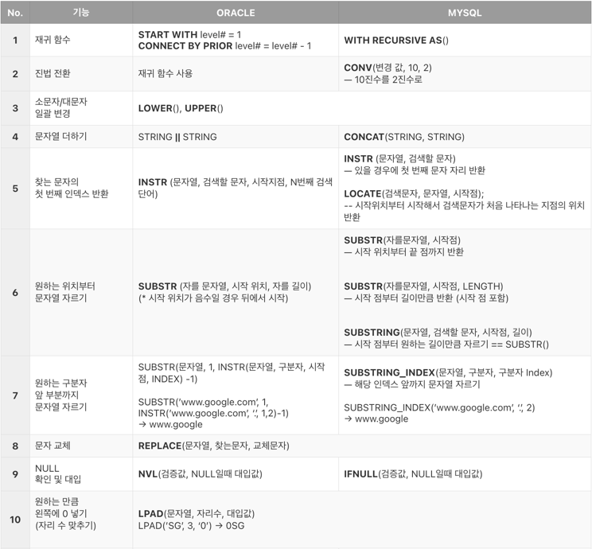
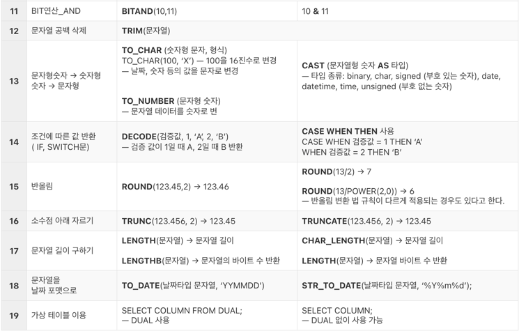
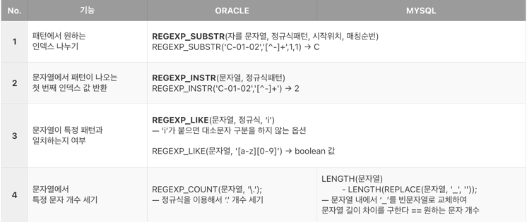
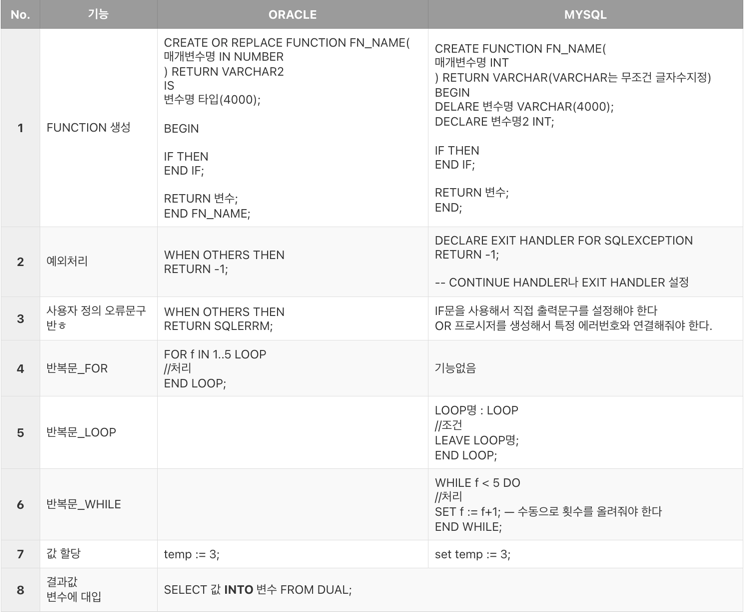

# Oracle Function vs MySQL Function

- `ORACLE` : PL/SQL (Procedural Language/SQL)  
- `MYSQL` : SQL/PSM (SQL/Persistent Stored Modules)

> MySQL에서 FUNCTION 생성 시 오류가 발생한다면 
> ```mysql
> show global variables like log_bin_trust_function_creators; --세팅 조회
> SET GLOBAL log_bin_trust_function_creators = 1; -- ON
> #SET GLOBAL log_bin_trust_function_creators = 0; -- OFF
> ``` 

## 일반 함수  




## 정규식 함수



## FUNCTION 생성



## 공통점

### FUNCTION에서 `:=` 와 `=` 의 차이

`:=`는 SELECT문의 결과 혹은 값을 변수에 할당하는데 사용된다.  

`=` 도 사용 가능하나, 비교 연산자로 사용될 때와 구분하기 위해 변수에 할당할 때에는 `:=` 를 사용.
