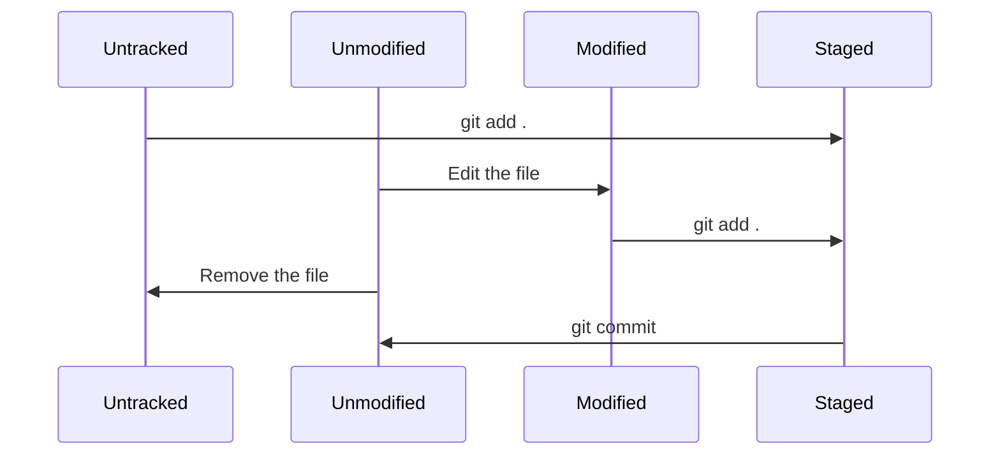

# Git의 기초

## Git 최초 설정

Git을 설정하기 위해 가장 먼저 해야할 것이 `git config` 입니다.  

### git config
1. `/etc/gitconfig`
    - 시스템의 모든 사용자와 모든 저장소에 적용되는 설정
    - `git config --system` 으로 설정 가능
2. `~/.gitconfig` or `~/.config/git/config`
    - 특정 사용자(현재 사용자)에게만 적용되는 설정
    - `git config --global` 으로 설정 가능
3. `.git/config`
    - Git 디렉토리에 있는 특정 저장소에만 적용되는 설정
    - `git config --local` 으로 설정 가능

각 설정은 역순으로 우선시 됩니다. 즉 local의 설정이 가장 우선적으로 적용됩니다.  

#### 사용자 정보 설정

```shell
git config --global user.name "John Doe"
git config --global user.email johndoe@example.com
```

#### 편집기(옵션)

git에서 사용할 텍스트 편집기를 설정할 수 있다.

```shell
git config --global core.editor emacs
```

#### 설정 확인

```shell
git config --list
git config user.name
```

### Git 저장소 만들기

Git 저장소는 로컬 디렉토리를 git 저장소로 적용하거나, `git clone`을 해오는 방식을 사용할 수 있다.  

```shell
# from local directory
git init
git add .
git add LICENSE
git commit -m 'initial project version'

# from remote repository
git clone <url>
```

## Git의 파일 상태 관리



### 파일 상태 확인하기

단순 파일의 변경을 확인하고 싶을 때에는 `git status`를, 변경 내용을 보고 싶을 때에는 `git diff`를 사용합니다.  

> [!NOTE]  
> 다만 `git diff`의 경우에는 `Unstaged` 상태인 것들만 보여주기에, 수정된 모든 파일이 Staged 상태라면 아무것도 출력되지 않습니다.  
> Staged 상태인 파일은 `--staged` 혹은 `--cached` 플래그를 사용합니다.  

```shell
git status
git status -s

git diff # 워킹 디렉토리와 Staging Area에 있는 것을 비교한다.
git diff --staged # Commit한 것과 Staging Area에 있는 것을 비교한다.  
git diff --cached # --staged와 같다.
```


### 파일 삭제하기

Git에서 파일을 제거하려면 `git rm` 명령으로 Staged 상태의 파일을 삭제한 뒤 커밋해야 합니다.  

`git rm`은 워킹 디렉토리에 있는 파일도 삭제하기 때문에 실제로 파일도 지워집니다.  

> [!TIP]  
> 파일은 그대로 두되, git에서 추적하지 않길 바라는 경우.  
> 즉 gitignore의 대상이 되는 파일이 staged 상태일 때 `git rm --cached <대상파일>` 을 해준 뒤 다시 커밋을 해주면 된다.  

## 커밋 히스토리 조회하기

```shell
git log
git log -p -2 # -p는 각 커밋의 diff결과 / -2는 최근 두 개의 결과만 출력
git log --stat # 커밋 통계치 출력
git log --pretty=oneline # 한 줄로 이쁘게 출력
git log --pretty=format:"%h - %an, %ar : %s" # 출력을 포멧팅
```

### 커밋 합치기 

완료한 커밋을 수정하고싶은데, 그 내용이 단순 오탈자의 수정이나 파일을 빼먹은 경우에 불필요한 커밋을 줄이기 위해 `--amend` 옵션을 사용합니다.  

```shell
git commit -m 'initial commit'
git add forgotten_file
git commit --amend # 이 커밋은 initial commit을 덮어 씀. 여기서 메시지를 수정할 수도 있음
```

## 리모트 저장소

리모트 저장소는 인터넷이나 네트워크 어딘가에 있는 저장소입니다.  

`git clone` 을 하게되면, `origin`이라는 리모트 저장소가 자동으로 등록됩니다.  

```shell
git remote -v # 단축 이름과 리모트 저장소 URL 확인 가능
git remote add <name> <url> # 리모트 저장소 추가
git remote show <name> # 리모트 저장소의 구체적 정보 확인
git remote rename <old> <new> # 리모트 저장소의 이름 변경
git remote remove <name> # 리모트 저장소 삭제

git pull <name> <branch-name> # 데이터를 가져오며 자동 머지 fetch + merge
git push <name> <branch-name> # 리모트 저장소에 push
```

## 태그

태그는 보통 릴리즈 시 사용됩니다. (v1.0 등...)  
태그 생성 시 커밋 체크섬을 붙여주지 않으면 현재 브랜치의 최신 커밋에 해당 태그가 붙게 됩니다.  

```shell
git tag # tag 조회
git tag -l "v1.8.5*" # v1.8.5 로 시작하는 모든 태그 검색
```

### Annotated 태그

Git 데이터베이스에 태그를 만든 사람의 이름, 이메일, 날짜 그리고 메시지를 저장하는 태그입니다. `GPG(GNU Privacy Guard)`로 서명할 수도 있습니다.  

```shell
git tag -a v1.4 -m "my version 1.4" # -m 을 통해서 태그 메시지 생성
git show v1.4 # 태그와 커밋 정보 확인
```

### Lightweight 태그

파일에 커밋 체크섬을 저장하는 것일 뿐 다른 정보는 저장하지 않고 이름만 달아줍니다.  

그렇기 때문에 `git show`를 하더라도 별도의 태그 정보를 확인 할 수 없습니다.  

```shell
git tag v1.4-lw
```

### 나중에 태그하기

이전 커밋에서도 커밋 체크섬만 알고 있다면 태그를 달아줄 수 있습니다.  

```shell
git tag -a v1.2 <commit-checksum>
```

### 태그 공유하기

`git push` 명령어로는 리모트 서버에 태그를 전송하지 않습니다.  

브랜치를 공유하는 것과 같은 방법으로 전송합니다.  

```shell
git push origin <tag-name> # 특정 태그 push
git push origin --tags # 모든 태그 push
```