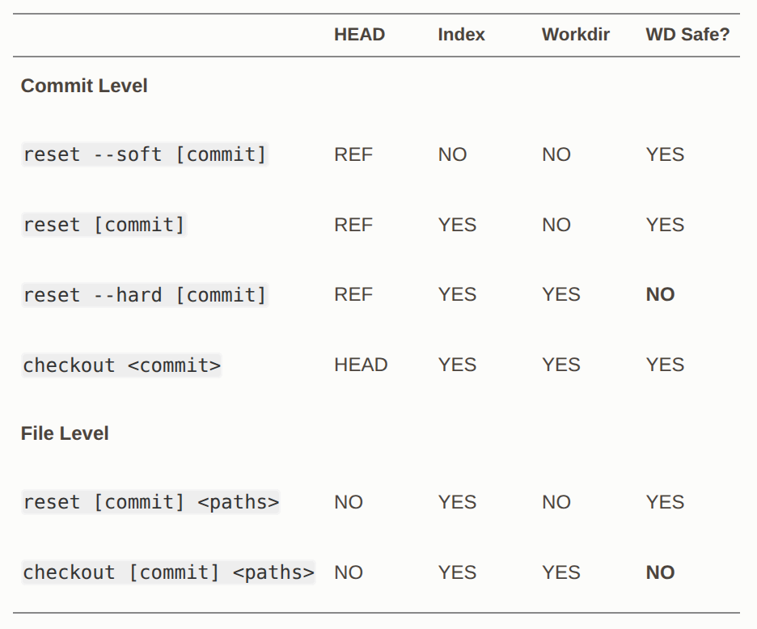

# Stash

브랜치에서 작업중인데, 다른 브랜치로 옮겨야하는 상황입니다.  
이러한 경우에, 커밋을 남기기 껄끄러운 경우에 Stash를 사용합니다.  

## Stash 리스트에 append

```shell
git status

Changes to be committed:
  (use "git reset HEAD <file>..." to unstage)

  modified:   index.html

Changes not staged for commit:
  (use "git add <file>..." to update what will be committed)
  (use "git checkout -- <file>..." to discard changes in working directory)

  modified:   lib/simplegit.rb

git stash

# 이미 Staging Area에 들어있는 파일을 Stash하지 않음
git stash --keep-index

# 추적중이지 않은 파일도 같이 저장
git stash --include-untracked

git status

# On branch master
nothing to commit, working directory clean

git stash list

stash@{0}: WIP on master: 049d078 added the index file
stash@{1}: WIP on master: c264051 Revert "added file_size"
stash@{2}: WIP on master: 21d80a5 added number to log
```

## Stash에서 꺼내쓰기

```shell
# unStaged상태로 파일 복원
git stash apply 

# stash 골라서 적용하기
git stash apply stash@{2}

# Staged였던 것은 Staged상태로 파일 복원
git stash apply --index

# apply시 남아있는 Stash list의 자료를 삭제
git stash drop stash@{0}

# apply + drop
git stash pop
```

# Reset


