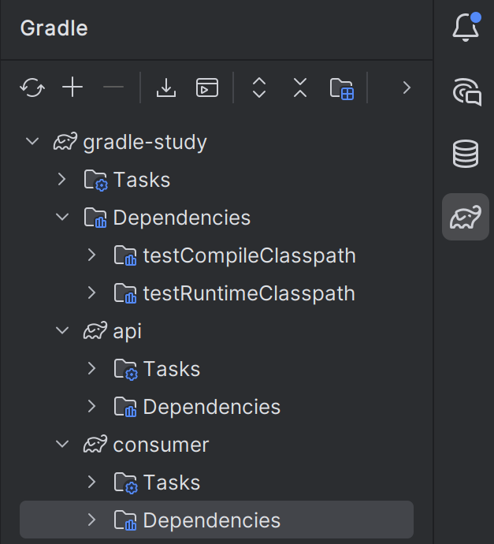
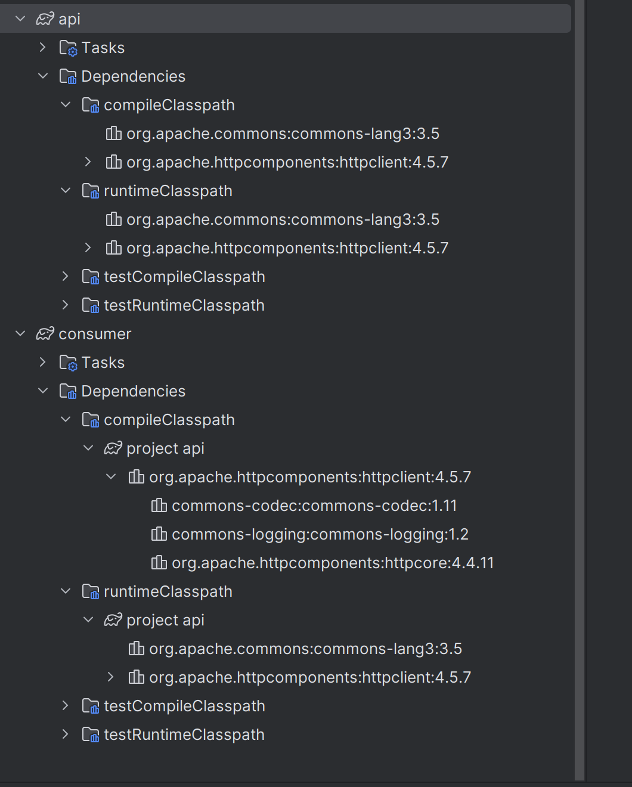
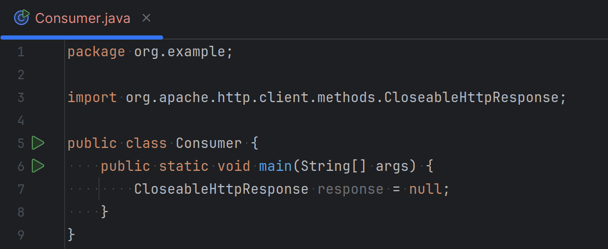
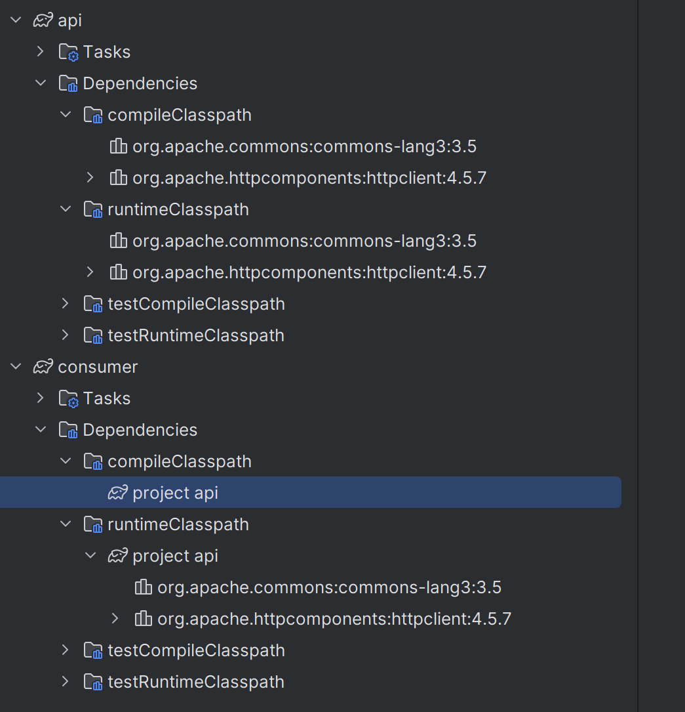
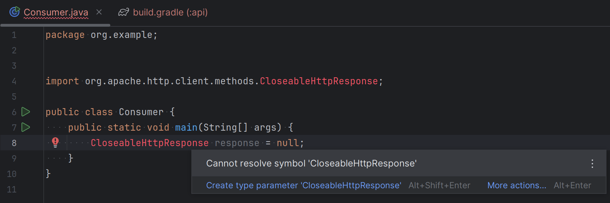

# Gradle build - implementation vs api

Gradle이란, Groovy를 기반으로 한 오픈소스 빌드 도구입니다.  
Groovy는 JVM에서 실행되는 스크립트 언어입니다.  

즉, Java 프로젝트를 쉽게 빌드하게 도와주는 도구입니다.  

Gradle은 프로젝트를 빌드합니다.  
프로젝트에는 빌드 스크립트가 포함되며, 대표적으로 `build.gradle`파일이 그것입니다.  
빌드 스크립트에는 프로젝트에 대한 테스크, 의존성, 플러그인 등등이 포함됩니다.  

단일 빌드에는 하나 이상의 프로젝트가 포함될 수 있으며 각 프로젝트에는 자체 하위 프로젝트가 포함될 수 있습니다.  
즉, 각 프로젝트는 서로를 의존하며 하나의 큰 프로젝트로 빌드될 수 있습니다.  

## 의존성을 어떻게 가져올까?

Gradle에서 의존성은 `dependency {}` 블럭 내부에서 관리됩니다.  

| 키워드                  | 의미                         |
| -------------------- | -------------------------- |
| `implementation`     | **내부적으로만 사용하는** 의존성        |
| `api`                | **외부에 노출되어야 하는** 의존성       |
| `compileOnly`        | 컴파일에만 필요하고 런타임에는 필요 없는 의존성 |
| `runtimeOnly`        | 런타임에만 필요한 의존성              |
| `testImplementation` | 테스트 코드 전용 의존성              |


위와 같은 키워드들로 의존의 수준을 관리할 수 있습니다.

### implementation vs api

결론적으로 아래와 같은 차이가 있습니다.  

| 구분                    | `implementation`  | `api`             |
| --------------------- | ----------------- | ----------------- |
| 외부 모듈에서 이 의존성에 접근 가능? | ❌ 아니요             | ✅ 예               |
| 빌드 성능                 | 더 빠름 (모듈간 캡슐화 유지) | 상대적으로 느림 (의존성 전파) |
| 캡슐화                   | O (숨겨짐)           | X (노출됨)           |
| 사용 예시                 | 내부 util, helper 등 | 외부에서 사용하는 라이브러리 등 |

여기까지 봤을 때, implementation은 `나까지만쓸게!!` 로 이해할 수 있고, api는 `너도 가져다 써` 로 이해했습니다.  

## Practice

```text
gradle-study/
├── consumer/             ← 최종 실행 모듈
└── api/         ← 공통 라이브러리 모듈
```

위 구조로 자바 프로젝트를 만들었습니다.  

### root project

#### build.gradle

```yaml
rootProject.name = 'gradle-study'
include 'api'
include 'consumer'
```

최상단 프로젝트는 자신의 하위 프로젝트인 api와 consumer를 알고 있습니다.  

### api project

예시를 위해 java-library 플러그인 프로젝트를 만들어보았습니다.  

> java-library 플러그인이란?   
> 
> The Java Library plugin expands the capabilities of the Java Plugin (java) by providing specific knowledge about Java libraries. In particular, a Java library exposes an API to consumers
> 
> 이라 나와있는데, 결론적으로 api로 다른 라이브러리에 기능을 노출하고 있는 라이브러리라 해당 실습에 사용했습니다.  

#### build.gradle

```yaml
plugins {
    id 'java-library'
}

group = 'org.example'
version = '1.0-SNAPSHOT'

repositories {
    mavenCentral()
}

dependencies {
    testImplementation platform('org.junit:junit-bom:5.10.0')
    testImplementation 'org.junit.jupiter:junit-jupiter'

    api 'org.apache.httpcomponents:httpclient:4.5.7'
//    implementation 'org.apache.httpcomponents:httpclient:4.5.7'
    implementation 'org.apache.commons:commons-lang3:3.5'
}

test {
    useJUnitPlatform()
}

```

api 키워드로 httpclient 라이브러리를 오픈한 상태입니다.  

### consume project

api project를 사용하는 프로젝트입니다.

#### build.gradle

```yaml
plugins {
    id 'java'
}

group = 'org.example'
version = '1.0-SNAPSHOT'

repositories {
    mavenCentral()
}

dependencies {
    testImplementation platform('org.junit:junit-bom:5.10.0')
    testImplementation 'org.junit.jupiter:junit-jupiter'

    implementation project(':api')
}

test {
    useJUnitPlatform()
}

```

동일한 상태로, 동 프로젝트의 api 프로젝트의 의존성을 설정한 것을 확인할 수 있습니다.  

### Build 해봅시다

root project의 위치에서 gradle을 clean 후 build 해보겠습니다.  

```shell
yh-pahn@yh-pahn-960XGL:~/gradle-study$ gradle clean
yh-pahn@yh-pahn-960XGL:~/gradle-study$ gradle build 
```

그럼 우측 코끼리에서 프로젝트가 잘 빌드된 것을 확인할 수 있습니다.  

  

각 프로젝트의 `Dependencies` 를 살펴보면, api와 implementation의 차이를 명확히 알 수 있습니다.  
  

consumer가 api 프로젝트가 api 키워드로 열어준 httpclient 라이브러리를 `compile 단계`에 알고 있지만,  implementation으로 닫아놓은 commons-lang 라이브러리는 알지 못합니다.  

그렇기 때문에 consumer 프로젝트에서, httpclient를 import 해서 사용할 수 있습니다.



### api -> implementation

만약 api 프로젝트가 라이브러리를 implementation으로 전파를 막는다면 어떻게 될까요?

#### build.gradle
```yaml
dependencies {
    testImplementation platform('org.junit:junit-bom:5.10.0')
    testImplementation 'org.junit.jupiter:junit-jupiter'

//    api 'org.apache.httpcomponents:httpclient:4.5.7'
    implementation 'org.apache.httpcomponents:httpclient:4.5.7'
    implementation 'org.apache.commons:commons-lang3:3.5'
}
```

이후 다시 루트 프로젝트에서 빌드를 해보면 consumer 프로젝트가 더이상 httpclient 라이브러리를 compile 단계에서 알지 못합니다.  



그렇기 때문에 consumer가 httpclient 라이브러리를 사용하려하면 컴파일에러가 발생합니다.  



> **runtimeClassPath vs compileClassPath**  
> 
> compileClasspath 는 "내 코드가 컴파일되기 위해서 뭐가 필요하냐?"  
> 
> runtimeClasspath 는 "내 프로그램이 실행되기 위해서 뭐가 필요하냐?"

## 정리  

| 구분                    | `implementation`  | `api`             |
| --------------------- | ----------------- | ----------------- |
| 외부 모듈에서 이 의존성에 접근 가능? | ❌ 아니요             | ✅ 예               |
| 빌드 성능                 | 더 빠름 (모듈간 캡슐화 유지) | 상대적으로 느림 (의존성 전파) |
| 캡슐화                   | O (숨겨짐)           | X (노출됨)           |
| 사용 예시                 | 내부 util, helper 등 | 외부에서 사용하는 라이브러리 등 |


프로젝트 빌드시, `compileClasspath`에 라이브러리를 알려주는지 아닌지에 따라 외부 모듈에서의 접근성이 설명되고, implementation의 경우 이런 의존성 전파를 막기 때문에 빌드 성능이 더 좋고 캡슐화가 잘 되어 있습니다.  

그렇기에 외부에 라이브러리의 기능을 노출시켜야 하는 상황에서, 두 키워드를 꼭 필요에 맞게 사용해야 빌드 성능이 좋아짐을 알 수 있습니다.
