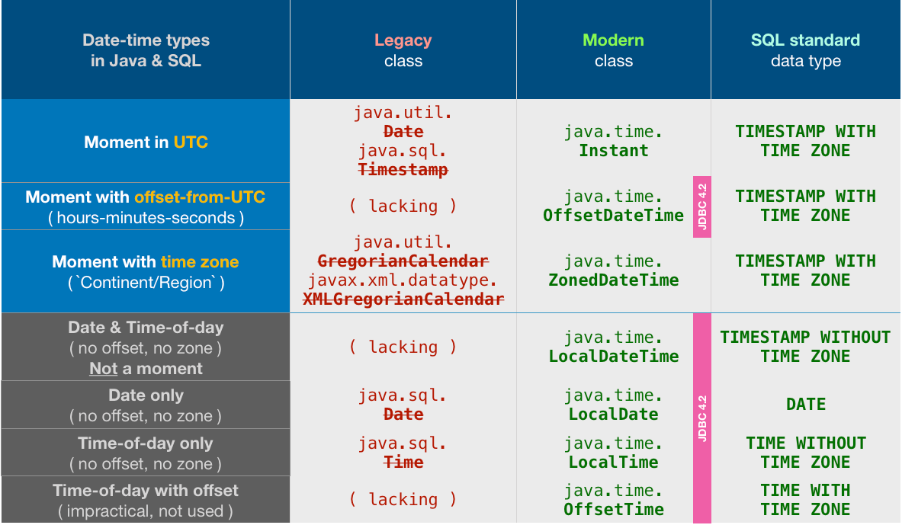

# 🕒 Java 8 `Clock` 클래스 완전 정리

`Clock`은 `java.time` 패키지에 포함된 추상 클래스이며, 시간 정보를 제공하는 전략 객체로서 주로 테스트나 시간 제어에 활용됩니다.

---

## ✅ 주요 목적

- **시스템 시계(System Clock)** 를 추상화
- `Instant`, `ZoneId`, `ZonedDateTime`, `LocalDateTime` 등을 생성할 때 **시간 제공자 역할**
- **테스트 코드에서 현재 시간을 고정하거나 조작**할 수 있도록 도와줌

---

## 🧱 기본 구조

```java
public abstract class Clock {
    public abstract ZoneId getZone();
    public abstract Clock withZone(ZoneId zone);
    public abstract Instant instant();

    public long millis() {
        return instant().toEpochMilli();
    }
}
```

---

## 🛠️ Clock 인스턴스 생성 메서드

### 1. `Clock.systemUTC()`
UTC 기준 시스템 시계를 반환
```java
Clock clock = Clock.systemUTC();
```

### 2. `Clock.systemDefaultZone()`
JVM의 기본 시간대를 사용하는 시스템 시계
```java
Clock clock = Clock.systemDefaultZone();
```

### 3. `Clock.system(ZoneId zone)`
특정 시간대를 사용하는 시스템 시계
```java
Clock clock = Clock.system(ZoneId.of("Asia/Seoul"));
```

### 4. `Clock.fixed(Instant fixedInstant, ZoneId zone)`
**항상 동일한 시간**을 반환하는 시계 (주로 테스트용)
```java
Clock clock = Clock.fixed(Instant.parse("2024-01-01T00:00:00Z"), ZoneId.of("UTC"));
```

### 5. `Clock.offset(Clock baseClock, Duration offset)`
기존 시계에 offset 만큼 시간차를 더해 새로운 시계 생성
```java
Clock clock = Clock.offset(Clock.systemUTC(), Duration.ofHours(2));
```

### 6. `Clock.tick(Clock baseClock, Duration tickDuration)`
지정한 시간 간격으로 시간값이 갱신되는 시계
```java
Clock clock = Clock.tick(Clock.systemUTC(), Duration.ofMinutes(1));
```

### 7. `Clock.tickSeconds(ZoneId zone)`
1초 단위로 갱신되는 시계
```java
Clock clock = Clock.tickSeconds(ZoneId.systemDefault());
```

### 8. `Clock.tickMinutes(ZoneId zone)`
1분 단위로 갱신되는 시계
```java
Clock clock = Clock.tickMinutes(ZoneId.of("Asia/Seoul"));
```

---

## 🧪 테스트 코드에서의 사용 예

```java
@Test
public void testFixedClock() {
    Clock clock = Clock.fixed(Instant.parse("2024-01-01T00:00:00Z"), ZoneId.of("UTC"));
    LocalDate date = LocalDate.now(clock);
    assertEquals(LocalDate.of(2024, 1, 1), date);
}
```

---

## 📌 `Clock`을 사용하는 예: 시간 기반 객체 생성

```java
Clock clock = Clock.systemUTC();

Instant now = clock.instant();
LocalDateTime dateTime = LocalDateTime.now(clock);
ZonedDateTime zonedDateTime = ZonedDateTime.now(clock);
```

---

## ⚠️ 유의사항

- `Clock`은 **불변 객체 (immutable)** 이며 **스레드 안전 (thread-safe)** 함
- `Clock`을 직접 생성하지 않고, **정적 팩토리 메서드**를 사용하여 인스턴스를 얻음
- `Clock`은 테스트에서 `System.currentTimeMillis()`를 대체할 수 있는 좋은 도구

---

## 🧠 결론

- `Clock`은 시간 의존 코드를 테스트 가능하게 만들며, 시스템 시계를 유연하게 제어할 수 있도록 도와주는 강력한 도구입니다.
- 다양한 팩토리 메서드를 통해 **정확도 제어**, **고정된 시간 설정**, **오프셋 추가**, **틱 단위 시간 측정** 등이 가능합니다.

---

# 📘 Java `Period`와 `Duration`

Java 8의 `java.time` 패키지는 날짜와 시간을 다루기 위한 강력한 도구들을 제공합니다. 그중 **`Period`**와 **`Duration`**은 **두 시간/날짜 사이의 간격을 표현**하기 위해 사용됩니다.

---

## ⏳ Period – 날짜 간격

### ✅ 용도
- **년, 월, 일** 단위의 차이를 표현
- `LocalDate`에 사용됨

### ✅ 생성 방법
```java
Period period1 = Period.ofDays(5);        // 5일
Period period2 = Period.ofWeeks(3);       // 3주 → 21일
Period period3 = Period.of(1, 2, 15);     // 1년 2개월 15일
```

두 날짜 간의 차이를 계산:
```java
LocalDate startDate = LocalDate.of(2020, 1, 1);
LocalDate endDate = LocalDate.of(2023, 4, 10);

Period between = Period.between(startDate, endDate);
```

### ✅ 주요 메서드
- `getYears()`, `getMonths()`, `getDays()`
- `isZero()`, `isNegative()`
- `plus()`, `minus()`
- `normalized()` – 예: 14개월 → 1년 2개월

---

## ⏱ Duration – 시간 간격

### ✅ 용도
- **초, 나노초** 단위의 차이를 표현
- `LocalTime`, `Instant`에 사용됨

### ✅ 생성 방법
```java
Duration duration1 = Duration.ofHours(5);
Duration duration2 = Duration.ofMinutes(90);
Duration duration3 = Duration.ofSeconds(120);
```

두 시간 사이의 차이 계산:
```java
LocalTime time1 = LocalTime.of(10, 0);
LocalTime time2 = LocalTime.of(13, 30);

Duration between = Duration.between(time1, time2);
```

또는 Instant 사용:
```java
Instant now = Instant.now();
Instant later = now.plus(Duration.ofSeconds(3600));

Duration diff = Duration.between(now, later);
```

### ✅ 주요 메서드
- `toMinutes()`, `toHours()`, `toDays()`
- `getSeconds()`, `getNano()`
- `isZero()`, `isNegative()`
- `plus()`, `minus()`

---

## ⚠️ Period vs Duration 비교

| 항목          | Period                      | Duration                      |
|---------------|-----------------------------|-------------------------------|
| 표현 단위     | 년, 월, 일                 | 시, 분, 초, 나노초            |
| 사용 대상     | `LocalDate`                | `LocalTime`, `Instant`       |
| 예시          | 생일, 만기일 계산 등       | 타이머, 시간 측정, 간격 등    |

---

## 🧠 결론

- `Period`는 **달력 날짜 차이**(년/월/일)에 적합
- `Duration`은 **정확한 시간 차이**(시/분/초/나노초)에 적합
- `ChronoUnit`을 사용하면 더 세밀한 단위도 다룰 수 있음

---

## ✅ 옛 것은 잊고 새로운 것을 사용하자

