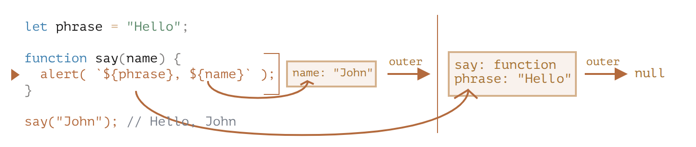
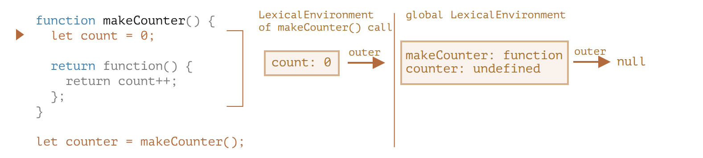
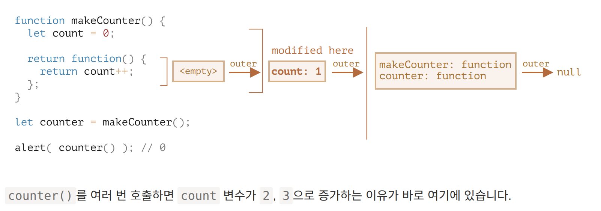

# 변수의 유효범위와 클로저

## 🔹 자바스크립트와 함수 지향성
자바스크립트는 함수형 언어적 특성을 지녀 함수를 다음과 같이 자유롭게 사용할 수 있다:

- 동적으로 생성
- 다른 함수에 인수로 전달
- 생성된 위치와 무관하게 호출 가능

---

## 🔹 유효 범위 (Scope)

### ✅ 블록 스코프
```javascript
{
  let message = "안녕하세요";
  alert(message); // 사용 가능
}
alert(message); // ReferenceError
```

### ✅ 제어문에서의 블록 스코프
```javascript
if (true) {
  let greeting = "안녕!";
  alert(greeting); // 안녕!
}
alert(greeting); // ReferenceError
```

### ✅ for 문 안에서의 스코프
```javascript
for (let i = 0; i < 3; i++) {
  alert(i); // 0, 1, 2
}
alert(i); // ReferenceError
```

---

## 🔹 중첩 함수와 외부 변수 접근
```javascript
function makeCounter() {
  let count = 0;
  return function() {
    return count++;
  };
}
let counter = makeCounter();
counter(); // 0
counter(); // 1
```

---

## 🔹 렉시컬 환경 (Lexical Environment)

### 구조
- **환경 레코드(Environment Record)**: 지역 변수 저장소
- **외부 렉시컬 환경 참조**: 외부 스코프 연결

```javascript
let phrase = "Hello";

function say(name) {
  alert(`${phrase}, ${name}`);
}
say("John");
```

### 실행 시 변수 탐색 흐름
1. 내부 렉시컬 환경 확인
2. 없다면 외부 렉시컬 환경으로 이동
3. 전역까지 탐색

---

## 🔹 클로저 (Closure)

### ✅ 정의
> 외부 변수에 접근할 수 있는 함수. 자바스크립트에서는 모든 함수가 클로저다.

```javascript
function outer() {
  let name = "John";
  return function inner() {
    return name;
  };
}
let f = outer();
f(); // "John"
```

---

## 🔹 클로저와 가비지 컬렉션
```javascript
function f() {
  let value = 123;
  return function() {
    alert(value);
  }
}
let g = f();
g = null; // 클로저가 참조 해제되면서 GC 대상이 됨
```

---

## 🔹 클로저의 오해: 반복문과 클로저
```javascript
function makeArmy() {
  let shooters = [];
  for (let i = 0; i < 10; i++) {
    let shooter = function() {
      alert(i);
    };
    shooters.push(shooter);
  }
  return shooters;
}
let army = makeArmy();
army[0](); // 0
army[5](); // 5
```

---

## 🔹 응용 예시

### ✅ sum(a)(b)
```javascript
function sum(a) {
  return function(b) {
    return a + b;
  }
}
sum(1)(2); // 3
```

### ✅ 필터 조건 함수
```javascript
function inBetween(a, b) {
  return function(x) {
    return x >= a && x <= b;
  };
}
function inArray(arr) {
  return function(x) {
    return arr.includes(x);
  };
}
```

### ✅ 객체 정렬 함수
```javascript
function byField(field) {
  return (a, b) => a[field] > b[field] ? 1 : -1;
}
```

---

## ✅ 핵심 요약
- **함수는 생성된 렉시컬 환경을 기억**한다.
- **외부 변수 참조는 호출 위치가 아닌 생성 위치**에 따라 결정된다.
- **모든 함수는 클로저**이며, 함수 내부에서 외부 변수를 안전하게 사용할 수 있다.
- 클로저는 변수 은닉, 상태 유지, 콜백 구성에 유용하다.

  
  

