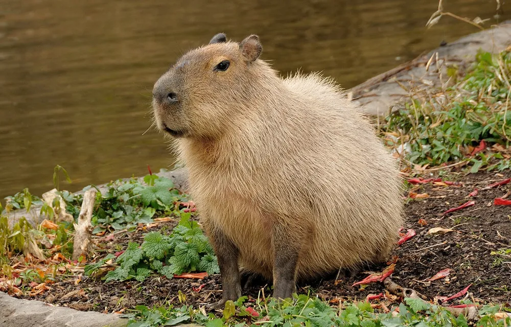

# Headers는 이렇게 만듭니다.

```
Try to put a blank line before...

# Heading

and after a heading.
```

> 이렇게 나와요! 
>> 1. `#`뒤의 내용은 한 칸 띄어주기
>> 2. Heading 앞 뒤엔 `blank line`
>> 3. `#`의 개수로 Header단계 조절 가능

Try to put a blank line before...

# Heading

and after a heading.

# Paragraphs와 줄바꿈은 취향차이

```
I really like using Markdown.

I think I'll use it to format all of my documents from now on.
```

> 이렇게 나와요!
>> 1. 문단 앞에 `tab` 넣지 않기
>> 2. 줄만 바꾸고 싶다면 `<br>` 사용

I really like using Markdown.

I think I'll use it to format all of my documents from now on.

# Emphasis 해봅시다.

```
I just love **bold text**

Italicized text is the *cat's meow*.

This text is ***really important***.

> #### The quarterly results look great!
>
> - Revenue was off the chart.
> - Profits were higher than ever.
>
>>  *Everything* is going according to **plan**.
```

> 이렇게 나와요!
>> 1. 강조 혹은 이탤릭시 `*`만 사용
>> 2. quotes 위아래에 `blank line` 사용

I just love **bold text**

Italicized text is the *cat's meow*.

This text is ***really important***.

> #### The quarterly results look great!
>
> - Revenue was off the chart.
> - Profits were higher than ever.
>
>>  *Everything* is going according to **plan**.

# List도 중요하죠

```

1. First item
2. Second item

---

- First item
- Second item
- 1968\. A great year!

---

- This is the first list item.
- Here's the second list item.

    > A blockquote would look great below the second list item.

- And here's the third list item.

---

1. First item
2. Second item
3. Third item

    - Indented item
    - Indented item

4. Fourth item
```

> 이렇게 나와요!
>> 1. `Ordered List`는 숫자 시작, `Unordered List`는 - 시작
>> 2. 만약 `Unordered List`의 시작이 숫자면 `\` 끝에 붙이기
>> 3. 리스트 내부에 중첩으로 요소를 넣고 싶으면 `blank line` + `tab` 후 사용

1. First item
2. Second item

---

- First item
- Second item
- 1968\. A great year!

---

- This is the first list item.
- Here's the second list item.

    > A blockquote would look great below the second list item.

- And here's the third list item.

---

1. First item
2. Second item
3. Third item

    - Indented item
    - Indented item

4. Fourth item

# Code도 써야겠죠?

> 백틱(`) 3개를 ```[언어명] (코드 입력)``` 사용해 코드를 입력

```java
public class Main {
    public static void main(String[] args) {
        System.out.println("Hello World!");
    }
}
```

# Anchor Like
```
#### Mention
@lopahn2 이것 좀 해주세요

#### Link
My favorite search engine is [Duck Duck Go](https://duckduckgo.com).

#### Adding Title
My favorite search engine is [Duck Duck Go](https://duckduckgo.com "The best search engine for privacy").

#### Quick turn url
<https://www.markdownguide.org>
<fake@example.com>

#### Putting the parts together
In a hole in the ground there lived a hobbit. it was a [hobbit-hole][1], and that means comfort.

[1]: <https://en.wikipedia.org/wiki/Hobbit#Lifestyle> "Hobbit lifestyles"

#### Images


#### Linking Images
[](https://www.flickr.com/photos/beaurogers/31833779864/in/photolist-Qv3rFw-34mt9F-a9Cmfy-5Ha3Zi-9msKdv-o3hgjr-hWpUte-4WMsJ1-KUQ8N-deshUb-vssBD-6CQci6-8AFCiD-zsJWT-nNfsgB-dPDwZJ-bn9JGn-5HtSXY-6CUhAL-a4UTXB-ugPum-KUPSo-fBLNm-6CUmpy-4WMsc9-8a7D3T-83KJev-6CQ2bK-nNusHJ-a78rQH-nw3NvT-7aq2qf-8wwBso-3nNceh-ugSKP-4mh4kh-bbeeqH-a7biME-q3PtTf-brFpgb-cg38zw-bXMZc-nJPELD-f58Lmo-bXMYG-bz8AAi-bxNtNT-bXMYi-bXMY6-bXMYv)
```

> 이렇게 나와요!
>> 1. Link의 url뒤 한 칸을 띄우고 `""` 안에 내용을 쓰면 마우스 호버링 시 링크의 제목이 나타나게 표현 가능
>> 2. Link에 넘버링을 통해서 가독성 좋게 긴 url들을 문단에서 관리 가능
>> 3. Image를 text처럼 사용해 이미지 링크 사용 가능
>> 4. 마크다운에서도 `\` escape 문자 정상 작동

#### Mention
@lopahn2 이것 좀 해주세요

#### Link
My favorite search engine is [Duck Duck Go](https://duckduckgo.com).

#### Adding Title
My favorite search engine is [Duck Duck Go](https://duckduckgo.com "The best search engine for privacy").

#### Quick turn url
<https://www.markdownguide.org>
<fake@example.com>

#### Putting the parts together
In a hole in the ground there lived a hobbit. it was a [hobbit-hole][1], and that means comfort.

[1]: <https://en.wikipedia.org/wiki/Hobbit#Lifestyle> "Hobbit lifestyles"

#### Images


#### Linking Images
[](https://www.google.com)