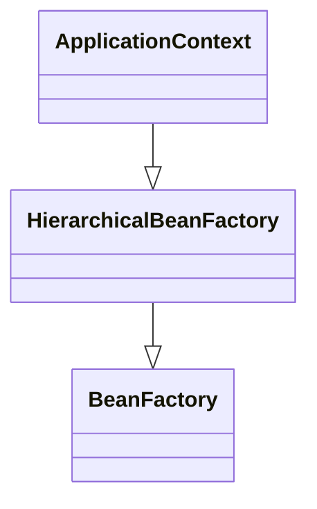
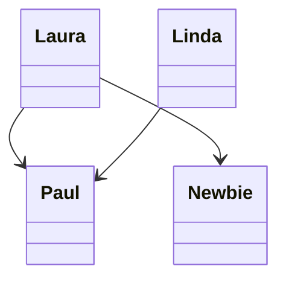
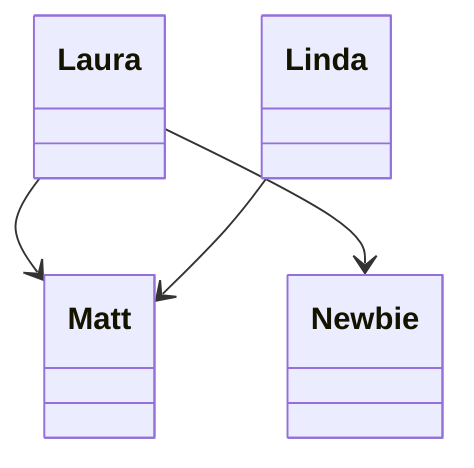
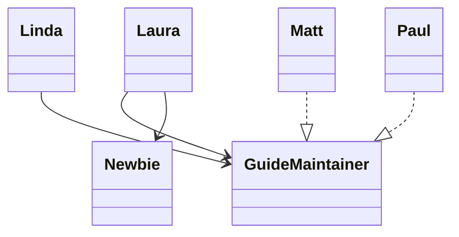

# Spring IoC 컨테이너와 DI 개념 정리

## 1. Spring IoC 컨테이너 구조

스프링은 IoC(Inversion of Control, 제어의 역전)를 위해 `IoC 컨테이너`를 제공합니다.
주요 인터페이스는 `BeanFactory`와 `ApplicationContext`이며, 이들은 아래와 같은 관계를 가집니다.



- **BeanFactory**: 가장 기본적인 IoC 컨테이너 인터페이스. Bean의 생성, 의존성 주입, 라이프사이클 관리의 최소 기능 제공
- **ApplicationContext**: BeanFactory의 기능 + 부가 기능 (AOP, 국제화, 이벤트 발행 등)
- **주의**: ApplicationContext를 거의 대부분의 프로젝트에서 사용하며, BeanFactory는 테스트나 극히 제한적인 상황에서만 사용됨.

---

## 2. Bean 등록 방법

스프링은 다양한 방법으로 Bean을 등록할 수 있음. 선택 기준은 상황에 따라 다르며, 공식 문서도 특정 방식을 강제하지 않음.

| 방법 | 특징 | 주의사항 |
| --- | --- | --- |
| XML | 전통적 방식 | 반복적 코드 많음, 가독성 낮음 |
| Annotation | `@Component`, `@Autowired` | DI 대상이 많아지면 관리 어려움 |
| Java Config | `@Configuration`, `@Bean` | 명시적, 타입 안전 |
| Groovy DSL | 유연함, DSL 문법 | 잘 쓰지 않음 |

### XML 예제

```xml
<bean id="petStore" class="org.springframework.samples.jpetstore.services.PetStoreServiceImpl">
    <property name="accountDao" ref="accountDao"/>
    <property name="itemDao" ref="itemDao"/>
</bean>
```

### Java Config 예제

```java
@Configuration
public class AppConfig {
    @Bean
    public MyService myService() {
        return new MyServiceImpl();
    }
}
```

### Annotation 예제

```java
@Component
public class MovieRecommender {
    @Autowired
    private CustomerPreferenceDao customerPreferenceDao;
}
```

### 주의사항
- XML과 Java Config, Annotation 방식을 혼용하면 관리가 어려움
- Annotation은 의존성 관리가 분산되기 때문에 설정 위치를 명확히 해야 함

---

## 3. Bean Scope와 Lifecycle

### Bean Scope

| Scope | 설명 | 특징 |
| --- | --- | --- |
| Singleton | 기본값, 컨테이너당 1개 | 대부분 이걸 씀 |
| Prototype | 요청마다 새 객체 | 상태 관리 주의 |
| Request | 웹 요청마다 새 객체 | 웹 전용 |
| Session | 세션마다 새 객체 | 웹 전용 |
| Application | 서블릿 컨텍스트당 1개 | |
| Websocket | 웹소켓 연결당 1개 | |

### 싱글톤 vs 프로토타입

```java
@Component
class SingletonDummy {}

@Component
@Scope(ConfigurableBeanFactory.SCOPE_PROTOTYPE)
class PrototypeDummy {}
```

- 싱글톤: 매번 동일 객체
- 프로토타입: 매번 새 객체

### Lifecycle Callback

- `@PostConstruct`, `@PreDestroy`
- `AutoCloseable` 인터페이스 사용 (추천, 프레임워크 종속성 낮춤)

---

## 4. DI 방법과 주의사항

### Constructor-based DI (권장)

```java
public class ExampleBean {
    private final AnotherBean beanOne;
    private final YetAnotherBean beanTwo;

    public ExampleBean(AnotherBean anotherBean, YetAnotherBean yetAnotherBean) {
        this.beanOne = anotherBean;
        this.beanTwo = yetAnotherBean;
    }
}
```

- 장점: 불변 객체, null 방지, 순환 의존성 조기 발견
- 주의: 생성자가 너무 많으면 코드 복잡

### Setter-based DI (선택적 의존성에만)

```java
public class ExampleBean {
    private AnotherBean beanOne;
    private YetAnotherBean beanTwo;

    public void setBeanOne(AnotherBean beanOne) {
        this.beanOne = beanOne;
    }
}
```

### @Autowired의 한계

- 명시적 DI보다 정확성 떨어짐
- 기본 타입 (int, String) 주입 불가
- 문서화 어려움

### Circular Dependency 주의

- 생성자 DI에서 순환 참조 발생 시 `BeanCurrentlyInCreationException` 발생
- 세터 DI로 임시 해결 가능하지만 권장되지 않음

---

## 5. 실습 코드 설명 (guide.ioc)


### guide.ioc.case00



```java
class CaseTest {

    private Laura laura;
    private Linda linda;

    @BeforeEach
    void setUp() {
        final Paul paul = new Paul();
        laura = new Laura(paul);
        linda = new Linda(paul);
    }

    @Test
    void test() {
        final Newbie newbie = new Newbie("Tom");
        laura.accept(newbie);
        linda.writeWiki();
    }
}
```

* Newbie: 신입사원
* Paul: 신입사원용 가이드의 오너
* Laura: Paul에 의존하여 신입사원에게 신입사원용 가이드를 제공
* Linda: Paul에 의존하여 신입사원용 가이드를 위키에 작성

### guide.ioc.case02



신입사원용 가이드의 오너가 Paul에서 Matt로 바뀌었다 가정합니다.

```java
class CaseTest {
    private Laura laura;
    private Linda linda;

    @BeforeEach
    void setUp() {
        final Matt matt = new Matt();
        laura = new Laura(matt);
        linda = new Linda(matt);
    }

    @Test
    void test() {
        final Newbie newbie = new Newbie("Tom");
        laura.accept(newbie);
        linda.writeWiki();
    }
}
```

Laura와 Linda가 의존하는 대상이 Paul에서 Matt로 변경되어,
이 때문에 Laura와 Linda의 구현이 달라졌습니다.

### guide.ioc.case03



SOLID 원칙 중 DIP 원칙을 준수하기 위해,
Linda와 Laura가 저수준의 모듈인 Matt나 Paul에 의존하지 않도록 GuideMaintainer 인터페이스를 도입합니다.

```java
public final class CaseTest {

    @Test
    void init() {
        final Paul paul = new Paul();
        final Laura laura = new Laura(paul);
        final Linda linda = new Linda(paul);

        final Newbie newbie = new Newbie("Tom");
        laura.accept(newbie);
        linda.writeWiki();
    }

    @Test
    void changed() {
        final Matt matt = new Matt();
        final Laura laura = new Laura(matt);
        final Linda linda = new Linda(matt);

        final Newbie newbie = new Newbie("Tom");
        laura.accept(newbie);
        linda.writeWiki();
    }
}
```

이로 인해 GuideMaintainer의 구현체가 Paul인지 Matt인지는 모르고도 Linda와 Laura가 동작할 수 있게 되었습니다.

### guide.ioc.case04

```java
class CaseTest {
    private Laura laura;
    private Linda linda;

    @BeforeEach
    void setUp() {
        final ApplicationContext applicationContext = new ClassPathXmlApplicationContext("newbie-guide-context.xml");
        laura = applicationContext.getBean(Laura.class);
        linda = applicationContext.getBean(Linda.class);
    }

    @Test
    void test() {
        final Newbie newbie = new Newbie("Tom");
        laura.accept(newbie);
        linda.writeWiki();
    }
}
```

이와 같은 객체와 객체 사이의 의존 관계나 생성 방법들을 직접 관리할 수도 있으나,
IoC 개념을 도입하기 위해 Spring IoC Container의 구현체 중 하나인 `ClassPathXmlApplicationContext`를 활용합니다.

```xml
<?xml version="1.0" encoding="UTF-8"?>
<beans xmlns="http://www.springframework.org/schema/beans"
       xmlns:xsi="http://www.w3.org/2001/XMLSchema-instance"
       xsi:schemaLocation="
        http://www.springframework.org/schema/beans http://www.springframework.org/schema/beans/spring-beans.xsd">
    <bean id="matt" class="guide.ioc.case04.Matt"/>

    <bean id="laura" class="guide.ioc.case04.Laura">
        <constructor-arg type="guide.ioc.case04.GuideMaintainer" ref="matt"/>
    </bean>
    <bean id="linda" class="guide.ioc.case04.Linda">
        <constructor-arg type="guide.ioc.case04.GuideMaintainer" ref="matt"/>
    </bean>
</beans>
```

XML 기반의 구성 메타 데이터는 위와 같으며,
생성자 기반으로 Bean Definition이 선언되어 있음을 알 수 있습니다.

### guide.ioc.case05

```java
class CaseTest {
    private Laura laura;
    private Linda linda;

    @BeforeEach
    void setUp() {
        final ApplicationContext applicationContext = new AnnotationConfigApplicationContext(NewbieGuideConfig.class);
        laura = applicationContext.getBean(Laura.class);
        linda = applicationContext.getBean(Linda.class);
    }

    @Test
    void test() {
        final Newbie newbie = new Newbie("Tom");
        laura.accept(newbie);
        linda.writeWiki();
    }
}
```

XML이 아닌 Annotation에 기반하여 구성 메타데이터를 작성하기 위해 `AnnotationConfigApplicationContext`을 이용하는 경우입니다.
AnnotationConfigApplicationContext의 인자로 Java 기반의 구성이 전달되고 있습니다.

```java
@Configuration
class NewbieGuideConfig {

    @Bean
    GuideMaintainer matt() {
        return new Matt();
    }

    @Bean
    Laura laura(final GuideMaintainer guideMaintainer) {
        return new Laura(guideMaintainer);
    }

    @Bean
    Linda linda(final GuideMaintainer guideMaintainer) {
        return new Linda(guideMaintainer);
    }
}
```

위는 전달된 구성입니다.
@Configuration을 통해 빈 선언의 묶음을 표현하고 있으며,
@Bean을 이용하여 각각의 빈을 선언하고 있습니다.

### guide.ioc.case06

```java
class CaseTest {
    private Laura laura;
    private Linda linda;
    private John john;

    @BeforeEach
    void setUp() {
        final ApplicationContext applicationContext = new AnnotationConfigApplicationContext("guide.ioc.case06");
        laura = applicationContext.getBean(Laura.class);
        linda = applicationContext.getBean(Linda.class);
        john = applicationContext.getBean(John.class);
    }

    @Test
    void test() {
        final Newbie newbie = new Newbie("Tom");

        laura.accept(newbie);
        linda.writeWiki();
        john.listen();
    }
}
```

AnnotationConfigApplicationContext를 이용하는 것은 동일하지만 인자로 자바의 패키지 이름이 전달되는 경우입니다.
이 경우 지정된 패키지 이하의 어노테이션를 탐색하여 BeanDefinition을 만들게 됩니다.

```java
@Component
class John {

    @Autowired
    private GuideMaintainer guideMaintainer;

    // ...
}
```

`@Component`를 이용하여 빈을 선언했으며,
`@Autowired`를 통해 DI가 되는 경우입니다.
John 객체가 생성된 이후 자바의 리플렉션을 이용하여 guideMaintainer가 설정됩니다.

```java
@Component
class Laura {
    private final GuideMaintainer guideMaintainer;

    Laura(final GuideMaintainer guideMaintainer) {
        this.guideMaintainer = guideMaintainer;
    }

    // ...
}
```

@Component를 이용하는 것은 같지만 생성자를 통해 의존성이 주입되는 경우입니다.
생성자가 하나이고 지정된 방법이 없으면 스프링은 기본적으로 생성자를 기반으로 BeanDefinition을 만들고 DI를 수행합니다.

```java
@Component
class Linda {
    private GuideMaintainer guideMaintainer;

    @Autowired
    public void setGuideMaintainer(final GuideMaintainer guideMaintainer) {
        this.guideMaintainer = guideMaintainer;
    }

    // ...
}
```

위와 같은 기본 동작은 @Autowired가 생성자에 붙은 형태를 생략한 것과 같습니다.
또한 이 경우 @Autowired는 JSR-330에 선언된 `@Inject`로 대신할 수 있습니다.

```java
@Component
class Matt implements GuideMaintainer {
    // ...
}
```

위와 같은 경우는 별도의 생성자가 없는,
다른 의존성이 필요하지 않은 경우입니다.

### guide.ioc.case07

```java
@Component
class SingletonDummy {
}
```

`SingletoneDummy`는 별도의 스코프 선언이 없기 때문에 싱글톤 스코프로 등록됩니다.

```java
@Component
@Scope(ConfigurableBeanFactory.SCOPE_PROTOTYPE)
class PrototypeDummy {
}
```

`PrototypeDummy`는 `@Scope(ConfigurableBeanFactory.SCOPE_PROTOTYPE)`를 통해 스코프가 프로토타입임을 나타내고 있습니다.

```java
class CaseTest {

    private ApplicationContext applicationContext;

    @BeforeEach
    void setUp() {
        applicationContext = new AnnotationConfigApplicationContext("guide.ioc.case07");
    }

    @Test
    void singleton() {
        final SingletonDummy first = applicationContext.getBean(SingletonDummy.class);
        final SingletonDummy second = applicationContext.getBean(SingletonDummy.class);

        assertThat(first).isSameAs(second);
    }

    @Test
    void prototype() {
        final PrototypeDummy first = applicationContext.getBean(PrototypeDummy.class);
        final PrototypeDummy second = applicationContext.getBean(PrototypeDummy.class);

        assertThat(first).isNotSameAs(second);
    }
}
```

싱글톤 스코프로 등록된 빈은 여러 번 참조해도 동일한 객체가 반환되며,
프로토타입 스코프로 등록된 빈은 참조될 때마다 다른 객체가 반환됩니다.

### guide.ioc.case08

```java
interface OrderRecorder {
    void markInitialized();

    void markProceeded();

    void markDestroyed();
}
```

```java
@Component
class OrderSensitiveDummy implements AutoCloseable {
    private final OrderRecorder recorder;

    OrderSensitiveDummy(final OrderRecorder recorder) {
        this.recorder = recorder;
        recorder.markInitialized();
    }

    void process() {
        recorder.markProceeded();
    }

    @Override
    public void close() throws Exception {
        recorder.markDestroyed();
    }
}
```

`OrderSensitiveDummy`는 싱글톤 스코프를 가지는 빈이며,
`java.lang.AutoCloseable`을 구현하고 있습니다.
OrderSensitiveDummy는 생성자를 통해 전달받은 `OrderRecorder`에 대한 참조를 유지하며,
생성자, process 메소드 호출 시, close 메소드 호출 시 각각 OrderRecorder의 `markInitialized`, `markProceeded`, `markDestroyed` 메소드를 호출합니다.

```java
class CaseTest {

    @Test
    void test() {
        final OrderRecorder orderRecorder = mock(OrderRecorder.class);
        verify(orderRecorder, never()).markInitialized();
        verify(orderRecorder, never()).markProceeded();
        verify(orderRecorder, never()).markDestroyed();

        final AnnotationConfigApplicationContext applicationContext = new AnnotationConfigApplicationContext();
        applicationContext.registerBean(OrderRecorder.class, () -> orderRecorder);
        applicationContext.scan("guide.ioc.case08");
        applicationContext.refresh();
        verify(orderRecorder, times(1)).markInitialized();
        verify(orderRecorder, never()).markProceeded();
        verify(orderRecorder, never()).markDestroyed();

        applicationContext.getBean(OrderSensitiveDummy.class).process();
        verify(orderRecorder, times(1)).markInitialized();
        verify(orderRecorder, times(1)).markProceeded();
        verify(orderRecorder, never()).markDestroyed();

        applicationContext.close();
        verify(orderRecorder, times(1)).markInitialized();
        verify(orderRecorder, times(1)).markProceeded();
        verify(orderRecorder, times(1)).markDestroyed();
    }
}
```
OrderRecorder 인터페이스를 Mockito를 이용하여 호출 정보를 기록할 수 있는 목 객체를 생성합니다.

`AnnotationConfigApplicationContext`을 작성한 이후,
목 객체를 빈으로 동적으로 등록한 뒤,
자바 패키지 이름으로 OrderSensitiveDummy 빈을 스캔하여 등록합니다.
이때 바로 생성자가 호출된 것을 알 수 있습니다.

마지막에 컨텍스트를 종료하면,
객체화되었던 빈의 소멸자가 호출되었음을 알 수 있습니다.
