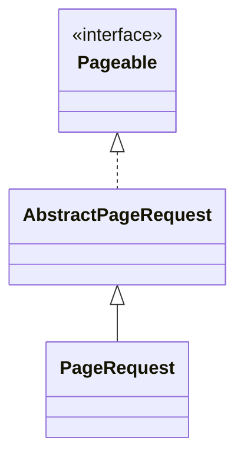
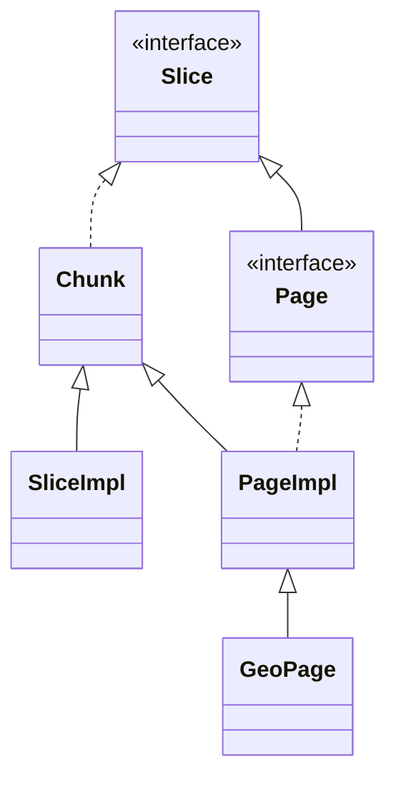

# 대용량 데이터 페이지네이션

## 기본 조회 ( SQL )

- 데이터 양이 적을 땐 `findAll()` 같은 걸로 전체 조회
  ```sql
  SELECT * FROM ToDos;
  ```
    데이터 양이 많으면 전체 조회 시 성능 저하 발생  
    → 네트워크 부하 때문에 문제가 생김


- 필요한만큼만 잘라서 보내주는 방식 사용
  ```sql
    SELECT * FROM ToDos
    ORDER BY created_at
    LIMIT 5
    OFFSET 100000;
  ```


`OFFSET = OFFSET + LIMIT` 으로 값을 늘려가며 다음 데이터를 받아오려면, 데이터 시퀀스가 존재해야 하고  
이를 위해서 특정 기준 ( 여기선 생성 일자 )을 가지고 정렬 함.  

이 경우에는 `100001`~`100005` 의 데이터가 출력되고, 앞에 10만개 데이터는 버려지게 됨.  
데이터가 많더라도, 앞에 OFFSET의 크기가 작으면 차이가 없지만, OFFSET의 크기가 커지는 순간부터 불필요한 테이블 스캐닝 과정이 추가 되어  성능 저하가  
발생하게 됨.  

그래서 OFFSET이 아닌 테이블의 특정 지점까지 확인했다는 정보를 얻을 수 있다면 WHERE 문으로 이를 해결할 수 있음  

```postgresql
SELECT * FROM ToDos 
WHERE ToDos.created_at < :createdAt
ORDER BY created_at
LIMIT 5
```

기준 값으로부터 5개의 데이터만을 가져오기에 앞에 버려지는 데이터가 없어 성능이 좋아짐.  
-> `Cursor 기반 페이지네이션`

> #### Q. WHERE 조건 걸어도 결국 테이블 전체 스캔 아님?  
> → 조건에 쓰는 컬럼에 INDEX 설정되어 있어야 함  
> → 일반적으로 DB는 인덱스 기준, 정렬된 상태로 조회 할 수 있음  
> → 인덱스 덕분에 성능 향상 가능

## JPA 조회 ( Pagination )  

```postgresql
SELECT * FROM posts LIMIT 10 OFFSET 20;
```

```oracle
SELECT * FROM (
  SELECT a.*, ROWNUM rnum FROM (
       SELECT * FROM posts
   ) a WHERE ROWNUM <= 30
) WHERE rnum > 20;
```

```java
List<Item> items = entityManager.createQuery("select i from Item i", Item.class)
                    .setFirstResult(0)
                    .setMaxResults(10)
                    .getResultList();
```

Pageable는 DBMS에 따라 페이지네이션을 구현하는 방법이 다르기 때문에, (Oracle, MySQL, ...) 이를 추상화 하기위한 인터페이스이다. 

기본적으로 JPA 는 `Pageable` 타입으로 질의가 들어오면, `Page` 객체로 응답을 만들어준다.

### PageRequest

다시 말해, Pageable은 페이지 요청 정보를 담는 인터페이스.  

우리는 이에 대한 구현 클래스인 `PageRequest`를 사용해 질의를 보낼 수 있다. 



PageRequest는 요청 정보를 담는 불변 객체이다. 필요에 따라 3개의 `of` 정적 메서드를 사용해 질의를 만들 수 있다.

```java
public class PageRequest extends AbstractPageRequest {
    // ...
	private final Sort sort;

	protected PageRequest(int pageNumber, int pageSize, Sort sort) {

		super(pageNumber, pageSize);

		Assert.notNull(sort, "Sort must not be null");

		this.sort = sort;
	}
    
	public static PageRequest of(int pageNumber, int pageSize) {
		return of(pageNumber, pageSize, Sort.unsorted());
	}
    
	public static PageRequest of(int pageNumber, int pageSize, Sort sort) {
		return new PageRequest(pageNumber, pageSize, sort);
	}
    
	public static PageRequest of(int pageNumber, int pageSize, Direction direction, String... properties) {
		return of(pageNumber, pageSize, Sort.by(direction, properties));
	}

	public static PageRequest ofSize(int pageSize) {
		return PageRequest.of(0, pageSize);
	}
    // ...
	@Override
	public PageRequest next() {
		return new PageRequest(getPageNumber() + 1, getPageSize(), getSort());
	}

	@Override
	public PageRequest previous() {
		return getPageNumber() == 0 ? this : new PageRequest(getPageNumber() - 1, getPageSize(), getSort());
	}

	@Override
	public PageRequest first() {
		return new PageRequest(0, getPageSize(), getSort());
	}
    // ...
}

```

#### Usage

```java
// only number and size
PageRequest request = PageRequest.of(0, 10);

// with sort
Sort sort = Sort.by("createdAt");
PageRequest request = PageRequest.of(0, 10, sort);

PageRequest request = PageRequest.of(0, 10, Sort.by(Direction.DESC, "createdAt"));

// with direction and properties
PageRequest request = PageRequest.of(0, 10, Sort.Direction.DESC, "createdAt");
```

### Page & Slice

Pageable로 요청을 보낸 이유는, 데이터를 페이지로 받기 위함인데 이를 처리해주는 객체가 Page와 Slice.  



기본적으로 Slice와 Page가 있으며,  

- Slice : 다음 페이지가 있는지만 알려주는 가벼운 페이징 결과 객체
- Page : Slice의 모든 기능 + 전체 페이지 수, 총 데이터 개수까지 제공

#### Page

```java
// 현재 페이지의 데이터
List<String> content = Arrays.asList("item1", "item2", "item3");

// Pageable 정보 (0번 페이지, 3개씩 조회)
Pageable pageable = PageRequest.of(0, 3);

// 전체 데이터 개수가 100개라고 가정
long total = 100;

// Page 생성
Page<String> page = new PageImple<>(content, pageable, total);
```

이때 전체 데이터 개수를 알아야 하기 때문에, Spring Data JPA는 내부적으로 `COUNT(*)` 쿼리를 별도로 실행해  전체 데이터 수를 조회함.  

즉 이 지점에서, 불필요하게 쿼리가 나가는 문제가 발생함.  

```java
Pageable pageable = PageRequest.of(pageNumber - 1, pageSize, Sort.by(Sort.Direction.DESC, "createdAt"));

Page<ToDoJpaEntity> page = 
        toDoJpaRepository.findByCreatedAtBetweenAndCompleted(startDateTime, endDateTime, completed, pageable);
        


public interface ToDoJpaRepository extends JpaRepository<ToDoJpaEntity, UUID> {
    Page<ToDoJpaEntity> findByCreatedAtBetweenAndCompleted(Instant startDateTime, Instant endDateTime, Boolean completed, Pageable pageable);    
}
```

```terminaloutput
Hibernate: 
    select
        tdje1_0.id,
        tdje1_0.completed,
        tdje1_0.content,
        tdje1_0.created_at 
    from
        todos tdje1_0 
    where
        tdje1_0.created_at between ? and ? 
        and tdje1_0.completed=? 
    order by
        tdje1_0.created_at desc 
    offset
        ? rows 
    fetch
        first ? rows only
        
Hibernate: 
    select
        count(tdje1_0.id) 
    from
        todos tdje1_0 
    where
        tdje1_0.created_at between ? and ? 
        and tdje1_0.completed=?
```

#### Slice

```java
 // 현재 페이지의 데이터
List<String> content = Arrays.asList("item1", "item2", "item3");

// Pageable 정보 (0번 페이지, 3개씩 조회)
Pageable pageable = PageRequest.of(0, 3);

// 다음 페이지가 있다고 가정
boolean hasNext = true;

// SliceImpl 생성
Slice<String> slice = new SliceImpl<>(content, pageable, hasNext);
```

Page 객체와 달리, Slice는 hasNext를 받는데, 이는 `COUNT(*)` 조회 쿼리가 필요하지 않다.  

Slice는 Pageable의 값으로 `pageSize = n` 이 들어오면, `OFFSET = n + 1` 로 조회해 다음 페이지가 있는지 조회한다.  

그렇기 때문에 불필요한 쿼리가 날라가지 않아 성능이 보다 중요할 때 사용한다.  

| 항목 | Page | Slice |
|------|------|-------|
| 다음 페이지 여부 | ✅ | ✅ |
| 전체 데이터 수 | ✅ | ❌ |
| COUNT 쿼리 발생 | ✅ | ❌ |

### Cursor 기반 Pagination

단, 전체 개수를 카운트하지 않을 뿐, 여전히 불필요한 OFFSET 부분이 사용되는 문제점이 있어서 Slice 만으로는 문제를 해결하기 어렵다.  

그렇기 때문에 클라이언트가 다음 페이지를 요청할 때 사용할 수 있는 식별자인 `Cursor` 를 사용해 테이블 스캐닝을 전체를 돌지 않고 필요한 만큼만 불러올 수 있다.  

> 인덱스는 정렬을 도와주는 지표일뿐 조회 시 PageRequest에 정렬 조건을 명시해주어야 한다.

```java
@Entity
@Table(
        name = "todos",
        indexes = {
                @Index(name = "idx_created_at", columnList = "createdAt"),
                @Index(name = "idx_created_at_id", columnList = "createdAt, id")
        }
)
public class ToDoJpaEntity {
    // ...
}
```


```java
@Override
public List<ToDo.data> findByCreatedAtBetweenAndCompletedWithCursor(Instant startDateTime, Instant endDateTime, Boolean completed, Instant createdAtCursor, int pageSize) {
    Pageable pageable = PageRequest.of(0, pageSize, Sort.by(Sort.Direction.DESC, "createdAt"));
    Slice<ToDoJpaEntity> slice = (createdAtCursor != null)
            ? toDoJpaRepository.findNextPage(createdAtCursor, completed, pageable)
            : toDoJpaRepository.findFirstPage(completed, pageable);

    return slice.map(ToDoMapper::toDataDto).toList();
}
```

```java
public interface ToDoJpaRepository extends JpaRepository<ToDoJpaEntity, UUID> {
    @Query("""
        SELECT t FROM ToDoJpaEntity t
        WHERE (:completed IS NULL OR t.completed = :completed)
    """)
    Slice<ToDoJpaEntity> findFirstPage(@Param("completed") Boolean completed,  Pageable pageable);

    @Query("""
        SELECT t FROM ToDoJpaEntity t
        WHERE t.createdAt < :createdAtCursor
            AND (:completed IS NULL OR t.completed = :completed)
    """)
    Slice<ToDoJpaEntity> findNextPage(@Param("createdAtCursor") Instant createdAtCursor,@Param("completed") Boolean completed ,Pageable pageable);
}
```
