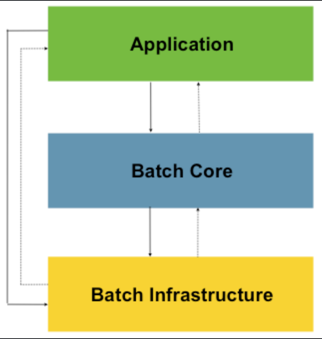
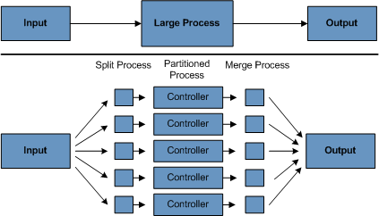
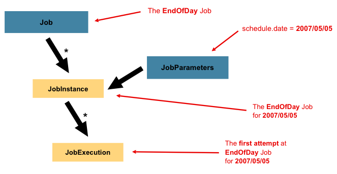
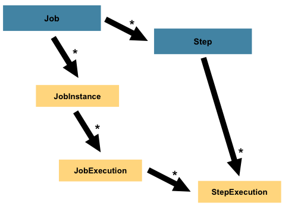

# Spring Batch

Spring Batch는 기업 도메인 내에서 일상 운영에 필수적인 배치 애플리케이션 개발을 지원하도록 설계된 `가볍고 포괄적인` 배치 프레임워크이다.  
Spring Framework의 특징 ( POJO 기반, 생산성, 사용 편의성 ... ) 을 기반으로 하며 `스케쥴러와 함께 동작`하는 것을 기대하며 설계됐다.

- 데이터베이스, 파일 또는 큐에서 많은 수의 레코드 읽기
- 어떤 방식으로든 데이터를 처리.
- 수정된 형태로 데이터를 다시 쓰기.

의 하나의 흐름을 처리하는데 특화돼있다. 

비지니스 일상 운영이라 함은, 

1. `사용자 상호작용 없이` 대량의 정보를 자동화하고 복잡하게 처리하거나 ( 시간 기반 이벤트 )  
2. 매우 큰 데이터 셋을 `반복적`으로 처리하거나  
3. 내부 및 외부 시스템에서 수신한 정보를 `통합`하여 일반적으로 트랜잭션 방식으로 포맷, 검증 및 처리가 필요한 정보를 기록 시스템에 통합

하는 작업들이 포함된다.  

SpringSource(현 VMware) 와 Accenture가 기업 IT 환경 내에서 Java 기반 배치 처리에 대한 지속적인 요구를 처리하기 위해 협력했으며,  
액센츄어는 스프링 배치 프로젝트에 기존에 독점적으로 사용하던 배치 처리 아키텍처 프레임워크를 제공함.

### 비지니스에서, 이럴 때 사용한다.  

- 주기적으로 일괄처리 프로세스를 수행해야 할 때
- 동시 일괄 처리: 작업의 병렬 처리가 필요할 때
- 단계적 엔터프라이즈 메시지 중심 처리가 필요할 때
- 대규모 병렬 배치 처리가 필요할 때
- 실패 후 수동 또는 예약된 재시작이 필요할 때
- 종속 단계의 순차적 처리(워크플로 기반 배치로 확장 가능) 가 필요할 때
- 부분 처리: 레코드 건너뛰기(예: 롤백 시) 가 필요할 때

## Spring Batch Architecture



Spring Batch Architecture는 총 3부분으로 나뉜다.

1. Application : 개발자가 스프링 배치를 활용해 작성한 모든 Batch Job과 Code 들
2. Batch Core : Batch Job을 실행하고 조작하기 위한 코어 런타임 클래스들 
   - ( JobLauncher, Job, Step의 구현체들 )
3. Batch Infrastructure : Application과 Batch Core가 올라가있는 공통 인프라. 
   - ( RetryTemplate, ItemReader, ItemWriter, core framework itself ... )

### 배치 가이드라인

가능한 단일 배치 어플리케이션에서 복잡한 논리적 구조를 가져가지 말고 데이터 처리와 저장을 물리적으로 가깝게 유지할 것.  

특히 불필요한 물리적 I/O를 방지하기 위해 SQL문을 분석해야 하는데,
- 데이터는 캐싱 할 수 있으면 캐싱한 데이터를 읽을 것
- 동일한 TX에서 이전에 읽은 데이터를 한 번 더 읽는 것 ( DB에 동일한 READ 요청을 날리는 것 )
- 불필요한 인덱스 스캔이 발생하는 것
  
위 3가지 경우를 주의해야 한다.  

또한, 데이터 무결성과 관련해서는 항상 최악의 상황을 가정하고 적절한 검증을 실시해야 한다.  
그렇기에 가능한 내부 검증을 위한 체크섬을 구현하자. ( 파일 레코드의 총계나 주요 필드의 집계 등... )  

### 일괄 처리 전략 ( 처리 옵션 )

#### 1. Normal processing in a batch window

온라인 유저들이나 다른 배치 프로세스에 데이터를 업데이트 해줄 필요가 없는 배치 프로세스로, 동시성은 문제가 되지 않으며 배치가 끝날 때 커밋을 하면 된다.  
하지만 간단한 시스템이더라도, 시간이 지나면 복잡성과 처리되는 데이터가 증가하기 때문에, 재시작-복구 옵션에 대한 커밋 로직의 필요성을 인지해야 함.  

#### 2. Concurrent batch or on-line processing

동시성이 큰 문제가 되기 때문에, Lock Strategy가 중요하다.  

1. `Optimistic locking` : 경합이 발생할 가능성이 낮다고 추정하는 락 방식이다. 데이터 업데이트시, timestamp도 함께 업데이트를 해주는 방식으로 동작한다. 
이때 insert를 하기 전의 timestamp와 작업이 긑난 후 그 timestamp가 같지 않으면, 다른 누군가가 업데이트를 한 것이라 판단해 업데이트를 하지 않는다.
2. `Pessimistic locking` : 경합이 발생할 가능성이 높다고 판단해 물리적 락을 얻는 방식이다. 데이터 레코드에 접근 시, lock column을 true로 변경한 다음에
본인의 업데이트 로직을 진행하고, 업데이트가 끝나면 lock column을 false로 변경한다.

일반적으로 낙관적 락은 온라인 어플리케이션에, 비관적 락은 일괄 처리 어플리케이션에 더 적합하다.  

#### 3. Parallel Processing

작업이 동일한 파일이나 데이터베이스 테이블 혹은 인덱스 공간을 공유하지 않는다면 병렬 처리를 통해, 총 배치 소요 시간을 최소화 할 수 있다.  
만일 이러한 공유 상태가 존재한다면, 해당 리소스에 대한 접근 순서를 정하거나 리소스를 분리해서 병렬 처리가 가능하도록 바꾸어야 한다.  

데이터 접근에 문제가 없다면 멀티 쓰레드로 작업을 돌리는데 이는 리소스에 대한 분석을 마친 후에 이루어져야 한다.  

#### 4. Partitioning



분할된 프로세스는 할당된 데이터 세트만 처리하도록 설계돼야 한다. 또한 그 아키텍처는 파티션 수를 동적으로 구성할 수 있을 만큼 유연해야 한다.  

- 레코드 세트의 균등/고정 분할
- 주요 열로 분할
- View별로 분석
- 처리 지표 ( Locking Column과 같은 것들 )

## Spring Batch Core


Job은 JobLauncher에 의해 실행되며, Job은 Step과 1:N 연관관계를 갖는다.  
또한 그 Step은 ItemReader, ItemProcessor, ItemWriter들과 1:1 연관관계를 갖는다.  

그리고 현재 실행되고 있는 리소스들의 메타데이터들은 JobRepository에 저장된다.  

### Job



Job은 전체 배치 프로세스를 캡슐화한 Entity이다.  

Spring Batch에서 Job은 단순히 Step 인스턴스들을 담고있는 컨테이너이다. 여러 Step들을 논리적으로 하나의 흐름으로 묶고 그 순서를 정함으로써, 재시작성을 높혀준다.  

```java
@Bean
public Job footballJob(JobRepository jobRepository) {
    return new JobBuilder("footballJob", jobRepository)
                     .start(playerLoad())
                     .next(gameLoad())
                     .next(playerSummarization())
                     .build();
}
```

#### JobInstance

JobInstance는 논리적 Job 실행의 개념이다.  
예를 들어 매일 실행되어야 하는 Job은 개념으로는 하나의 Job이지만 매일 실행되는 Job들은 개별적으로 추적돼야 한다.  

그렇기에 하나의 JobInstance는 N 번의 작업 시도를 할 수 있으므로 N 개의 JobExecution을 가질 수 있다.  

#### JobParameter

Job과 JobInstance는 동일하지 않을 수 있는데, 그 이유는 실행한 시간등과 같은 조건 때문이다.
1월 1일에 실행된 Job과, 1월 2일에 실행된 Job은 서로 다른 JobInstance이다. 여기서 Date와 같은 데이터가 JobParameter인 것이다.  

즉, JobInstance = Job + JobParameter 이다.

#### JobExecution

JobExecution은, 작업 실행을 위한 단일 시도라는 기술적 개념이다.  
JobInstance는 실행이 성공적으로 완료되지 않는 한 완료된 것으로 간주하지 않음.  
만약 JobInstance가 실패하면 JobExecution이 동일한 식별 작업 매개변수로 새로 생성되지만, JobInstance는 여전히 하나만 존재함.

| 속성              | 정의                                                                                                                             |
|-------------------|--------------------------------------------------------------------------------------------------------------------------------|
| **status**        | `BatchStatus` 실행 상태를 나타내는 속성. <br/>실행 중: `BatchStatus#STARTED`<br/>실패 시: `BatchStatus#FAILE` <br/>성공 시: `BatchStatus#COMPLETED` |
| **startTime**     | `java.time.LocalDateTime` 작업 실행이 시작된 시간.<br/> 작업 미시작시 비어있음                                                                     |
| **endTime**       | `java.time.LocalDateTime` 작업 실행이 완료된 시간 (성공 여부와 관계없음). <br/> 작업이 아직 완료되지 않은 경우 비어있음                                            |
| **exitStatus**    | `ExitStatus` 실행 결과. <br/>작업이 아직 완료되지 않은 경우 비어있음                                                                                |
| **createTime**    | `java.time.LocalDateTime` 이 `JobExecution` 이 처음 지속된 시간을 나타냄<br/> 작업이 시작되지 않았더라도 프레임워크에 의해 항상 존재                                |
| **lastUpdated**   | `java.time.LocalDateTime` 해당 `JobExecution` 이 마지막으로 지속된 시간을 나타냄<br/> 작업이 아직 시작되지 않은 경우 비어 있음.                                  |
| **executionContext** | 실행 간에 유지되어야 하는 사용자 데이터가 들어 있는 컨텍스트                                                                                         |
| **failureExceptions** | 작업 실행 중 발생한 예외들의 목록                                                                               |

> [!WARNING]  
> 서로 다른 JobInstance는 동시 실행이 가능하다. Spring Batch는 별도로 JobInstance 들이 동시에 실행되는 것을 막지 않음.  
> 단, 같은 JobInstance같은 경우에 중복 실행시 예외가 발생. `JobExecutionAlreadyRunningException`  
> 그렇기 때문에 두 작업이 동일한 데이터를 동시에 접근하려는 경우 DB 락 문제가 있으므로, 이를 스케쥴러 수준에서 제어해야 한다.  

### Step



Step은 일괄 작업의 연속적이고 독립적인 단계를 캡슐화한 도메인 객체이다.  
그렇기 때문에 모든 Job은 Step과 1:N 관계를 가지고 있다.

#### StepExecution

Step의 실행을 대표하는 클래스이다.  

StepExecution은 JobExecution과 유사하게 Step이 실행될 때 같이 생성된다.  
하지만 어떤 Step이 이전 단계의 Step의 실패에 의해 실행되지 않았을 때 해당 Step에 대한 실행은 유지되지 않음.  
오로지 Step의 실제 실행에 의해서만 생성됨.  

각 StepExecution는 ExecutionContext를 가지고 있어 개발자들이 일괄 작업들 사이에서 필요한 정보들을 사용할 수 있다. 

| 속성 (Property)        | 정의 (Definition)                                                       |
|------------------------|-----------------------------------------------------------------------|
| **status**             | 실행 중: `STARTED`<br/> 실패: `FAILED`<br/> 성공: `COMPLETED`                |
| **startTime**          | 실행이 시작된 시점의 시스템 시간을 나타내는 `java.time.LocalDateTime`<br/>아직 시작되지 않았다면 비어있음 |
| **endTime**            | 실행이 완료된 시점의 시스템 시간을 나타내는 `java.time.LocalDateTime`<br/>아직 종료되지 않았다면 비어있음 |
| **exitStatus**         | 실행 결과를 나타내는 `ExitStatus` |
| **executionContext**   | 실행 간에 유지되어야 하는 사용자 데이터                                      |
| **readCount**          | 성공적으로 읽은 항목의 수                                                    |
| **writeCount**         | 성공적으로 기록한 항목의 수                                                   |
| **commitCount**        | 이 실행에서 커밋된 트랜잭션 수                                               |
| **rollbackCount**      | 해당 Step이 제어하는 트랜잭션이 롤백된 횟수                                   |
| **readSkipCount**      | `read` 단계에서 실패하여 스킵된 항목 수                                |
| **processSkipCount**   | `process` 단계에서 실패하여 스킵된 항목 수                                   |
| **filterCount**        | `ItemProcessor`에서 필터링된 항목 수                                   |
| **writeSkipCount**     | `write` 단계에서 실패하여 스킵된 항목 수                                    |

### ExecutionContext

ExecutionContext는 키-값 형태의 데이터를 저장하는 컨테이너로, Spring Batch가 Job과 Step의 실행 상태를 유지하고 재시작 기능을 지원하기 위해 사용.  

데이터는 영속적으로 저당되며 데이터베이스에 저장된다. 특히 재시작 시점에서 실행 상태를 복원하는 데 핵심적인 역할 수행.  

예를들어 executionContext에 지금까지 읽은 줄을 저장한다 했을 때

```java
executionContext.putLong(getKey(LINES_READ_COUNT), reader.getPosition());
```

다시 시작했을 때 해당 라인을 읽어서 거기서부터 다시 작업을 재개할 수 있게 된다.  

```java
if (executionContext.containsKey(getKey(LINES_READ_COUNT))) {
    log.debug("Initializing for restart. Restart data is: " + executionContext);

    long lineCount = executionContext.getLong(getKey(LINES_READ_COUNT));

    LineReader reader = getReader();

    Object record = "";
    while (reader.getPosition() < lineCount && record != null) {
        record = readLine();
    }
}
```

#### ExecutionContext는 누가 가지고 있나?

JobExecution와 StepExecution 당 하나가 생성된다. 즉, 하나의 Job에 여러 Step이 있으면 여러개의 ExecutionContext가 생성된다.   
Step 범위의 ExecutionContext는 커밋 시점마다 저장되고, Job 범위의 ExecutionContext는 Step간 전환 시점마다 저장된다. 

```java
ExecutionContext ecStep = stepExecution.getExecutionContext();
ExecutionContext ecJob = jobExecution.getExecutionContext();
//ecStep does not equal ecJob
```

### 기타 자원

#### JobRepository

JobLauncher, Job, Step 들에 대한 저장소 메커니즘을 제공한다.  

JobRepository는 위 3개 ( Batch Stereotype ) 에게 CRUD 기능을 제공한다.  

Job이 처음 실행되면, JobExecution을 repository에서 가져온다. 또한 실행되는 동안 StepExecution과 JobExecution의 구현체들이 저장소로 전달되어 유지된다.
Java Configuration을 사용시, `@EnableBatchProcessing` 을 사용하면 하나의 JobRepository를 제공해준다.  

```java
package org.springframework.boot.autoconfigure.batch;

// ...
@ConditionalOnMissingBean(value = DefaultBatchConfiguration.class, annotation = EnableBatchProcessing.class)
// ...
public class BatchAutoConfiguration {
    // ...
}
```

#### JobLauncher

JobLauncher는 주어진 JobParameter들의 집합으로 Job을 실행시키기 위한 인터페이스이다.

```java
public interface JobLauncher {
   JobExecution run(Job job, JobParameters jobParameters)
               throws JobExecutionAlreadyRunningException, JobRestartException,
                      JobInstanceAlreadyCompleteException, JobParametersInvalidException;
}
```

#### ItemReader

ItemReader는 Step의 입력을 한 번에 하나의 항목씩 가져오는 것을 나타내는 추상화이다.  
ItemReader가 제공할 수 있는 항목을 모두 소진하면 null을 반환하여 이를 나타낸다.  

#### ItemWriter

ItemWriter는 Step의 출력을 한 번에 하나의 배치 또는 청크 단위로 나타내는 추상화이다.   
일반적으로 ItemWriter는 다음에 어떤 입력을 받아야 하는지 알지 못하며 현재 호출에서 전달된 항목만 알고 있다.

#### ItemProcessor

ItemProcessor는 항목의 비즈니스 처리를 나타내는 추상화이다.  
ItemReader는 하나의 항목을 읽고 ItemWriter는 하나의 항목을 쓰지만, ItemProcessor는 변환 또는 기타 비즈니스 처리를 적용하기 위한 액세스 포인트를 제공한다.  
항목을 처리하는 동안 항목이 유효하지 않다고 판단되면 null을 반환하여 해당 항목이 기록되지 않아야 함을 나타낸다. 
